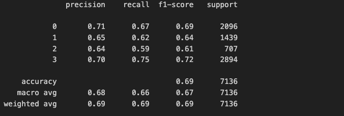
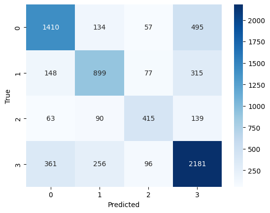
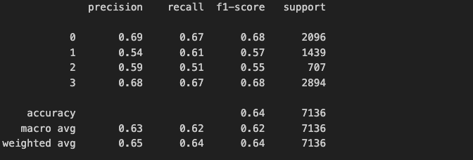
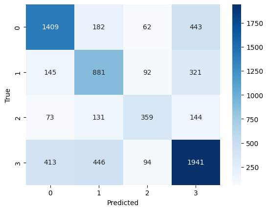
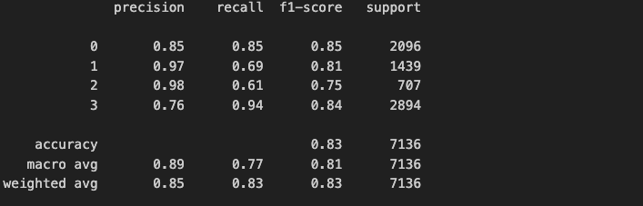
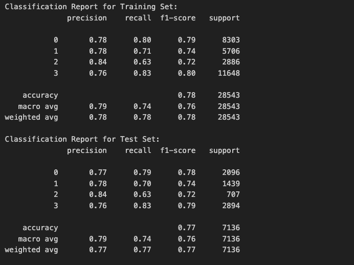
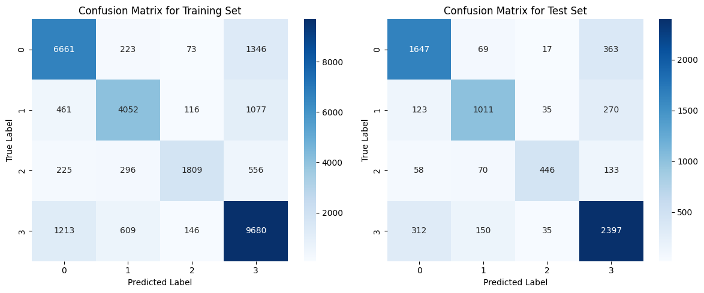
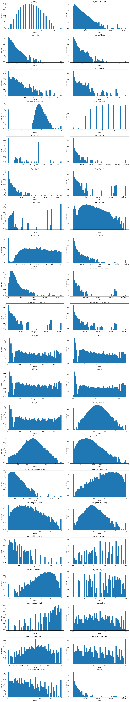
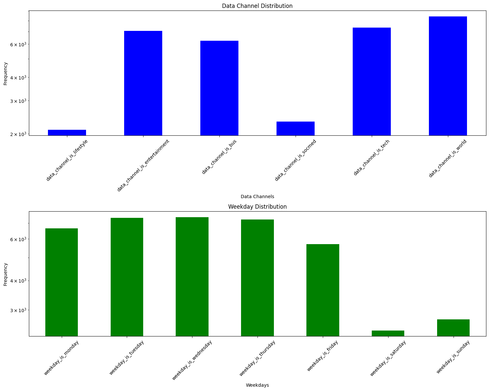
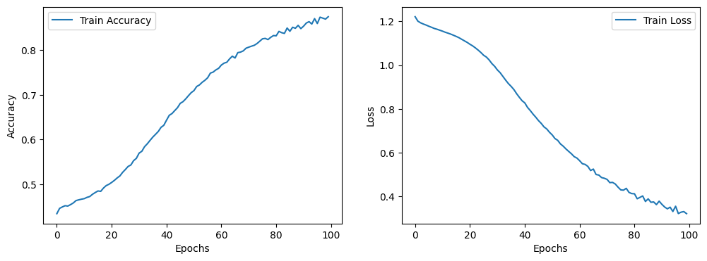

# Online News Popularity Predictor


## Link to Jupyter Notebook
* __Data Exploration:__ [Link](https://github.com/WeichenZhang89/ecs-171-ecs/blob/main/Data%20Exploration.ipynb) 
* __Data preprocessing and ML models:__ [Link](https://github.com/WeichenZhang89/ecs-171-ecs/blob/main/Data%20Preprocessing%20%26%20ML%20model.ipynb)
* __Improved ML model:__ [Link](https://github.com/WeichenZhang89/ecs-171-ecs/blob/main/Improved%20ML%20model.ipynb)


## Dataset
* __Filename:__ [OnlineNewsPopularity.csv](OnlineNewsPopularity.csv)
* __Source:__ [Kaggle](https://www.kaggle.com/datasets/thehapyone/uci-online-news-popularity-data-set)
* __Dataset Detail:__ [Link](OnlineNewsPopularity.names)


## How to use this project
1. __Clone the repo:__ `git clone https://github.com/WeichenZhang89/ecs-171-ecs`
2. __Install libraries:__ `pip install pandas tensorflow matplotlib seaborn scikit-learn (on Terminal)`
3. __Install libraries:__ `!pip install pandas tensorflow matplotlib seaborn scikit-learn (on colab)`
4. __Run model:__ `python ML_model.ipynb`

   You might encounter "ImportError : No Moduled Name "tensorflow" when running "import tensorflow as tf". 

   To solve this, you can uninstall tensorflow and then reinstall it by pip uninstall tensorflow + pip install tensorflow in terminal.

   If you encounter "ERROR: Could not install packages due to an OSError: [Errno 2] No such file or directory" 

   and "HINT: This error might have occurred since this system does not have Windows Long Path support enabled"

   the most easy way to solve this is going into the registry editor with this directory "Computer\HKEY_LOCAL_MACHINE\SYSTEM\CurrentControlSet\Control\FileSystem", 

   and then edit "LongPathsEnabled" to a value of 1. Then it should be done.


## Introduction
The number of shares an online news article gets is of great interest to news sites and advertisers alike since it serves as a good estimator of how many people an article will reach. Our data set includes various attributes that can potentially influence the number of shares, such as the number of links, pictures, and videos the article has; which day of the week the article was released, what category the article belongs to (business, entertainment, tech, etc), the number of positive or negative words, among many others. Applying the right machine learning model, we will be able to predict how popular an article will be. With accurate predictions, authors and news outlets will be able to make relevant changes to increase engagement from readers before release. 

### Previous work

Most of the work on Kaggle employed a regression algorithm to fit the number of shares (target) using the various features of the data set. We saw few that used an SVM to predict the target, and one that used the a Random Forest. To differentiate ourselves from the work that has already been done, we combined the many methods we learned this quarter (linear regression, neural nets, SVM, Random Forest) to create a new ensemble model. 

## Methods
### Data Exploration
[Link to data exploration notebook](https://github.com/WeichenZhang89/ecs-171-ecs/blob/main/Data%20Exploration.ipynb)

#### 1. Reading the CSV file
- The data was loaded from the OnlineNewsPopularity.csv file into a Pandas DataFrame
```
data = pd.read_csv('OnlineNewsPopularity.csv')
data.columns = [col.strip() for col in data.columns]
```

#### 2. Observations and Features
- Determined the total number of observations (rows) and features (columns).
```
# Total rows
print(f"Total number of observations: {data.shape[0]}\n")
# Total columns
print(f"Total number of columns: {data.shape[1]}\n")
```

#### 3.Descriptive Statistics
- Displayed the descriptive statistics for each column.
```
pd.set_option('display.max_columns', None)
data.describe()
```

#### 4.Checking Missing Values
- Checked the dataset for missing values
```
null_data_count = data.isnull().sum().sum()
print (f"There are total of {null_data_count} missing data")
```

#### 5. Scatter Plots for Features vs. Shares
- Created scatter plots for each feature against the 'shares' column.
```
fig = plt.figure(figsize=(50, 50))

# Remove all data can not be plotted
plot_columns = []
for column in columns:
    if column not in ['url', 'timedelta', 'shares']:
        plot_columns.append(column)

plt_cols = 6
plt_rows = len(plot_columns) // plt_cols + 1

fig, axes = plt.subplots(nrows=plt_rows, ncols=plt_cols, figsize=(50, 5*plt_rows))

for i, col in enumerate(plot_columns):
    ax = axes[i // plt_cols, i % plt_cols]
    ax.scatter(data[col], data['shares'])
    ax.set_xlabel(col)
    ax.set_ylabel('shares')
    ax.set_title(f'{col} vs shares')

plt.tight_layout()
plt.show()
```

#### 6. Distribution of Continuous Features
- Visualized the distribution of continuous features using histograms.
```
# List of categorical columns provided by the dataset
categorical_cols = [
    'data_channel_is_lifestyle', 'data_channel_is_entertainment',
    'data_channel_is_bus', 'data_channel_is_socmed', 'data_channel_is_tech',
    'data_channel_is_world', 'weekday_is_monday', 'weekday_is_tuesday',
    'weekday_is_wednesday', 'weekday_is_thursday', 'weekday_is_friday',
    'weekday_is_saturday', 'weekday_is_sunday', 'is_weekend', 'url',
    'timedelta'
]
extra_drop = [
    "n_unique_tokens", "n_non_stop_words","n_non_stop_unique_tokens"
]
# Remove discrete columns from being plotted
continuous_data = data.drop(columns=categorical_cols+extra_drop)

fig, axes = plt.subplots(nrows=len(continuous_data.columns) // 2 + len(continuous_data.columns) % 2, ncols=2, figsize=(15, 80))

for ax, column in zip(axes.flatten(), continuous_data.columns):
    continuous_data[column].hist(ax=ax, bins=50, grid=False)
    ax.set_title(column)
    ax.set_xlabel('Values')
    ax.set_ylabel('Frequency')
    ax.set_yscale('log')
# Hide any unused subplots
for i in range(len(continuous_data.columns), len(axes.flatten())):
    axes.flatten()[i].axis('off')

plt.tight_layout()
plt.show()
```

#### 7. Distribution of One-Hot Encoded Categorical Features
- Plotted histograms for one-hot encoded categorical features.
```
#Related one-hot encoded columns histograms

data_channel_cols = [col for col in data.columns if col.strip().startswith('data_channel_is_')]
weekday_cols = [col for col in data.columns if col.strip().startswith('weekday_is_')]

fig, axes = plt.subplots(nrows=2, ncols=1, figsize=(15, 12))

# Plotting for data_channel columns
data[data_channel_cols].sum().plot(kind='bar', ax=axes[0], color='blue')
axes[0].set_title('Data Channel Distribution')
axes[0].set_xlabel('Data Channels')
axes[0].set_ylabel('Frequency')
axes[0].tick_params(axis='x', rotation=45)  # Tilting x axis labels
axes[0].set_yscale('log')

# Plotting for weekday columns
data[weekday_cols].sum().plot(kind='bar', ax=axes[1], color='green')
axes[1].set_title('Weekday Distribution')
axes[1].set_xlabel('Weekdays')
axes[1].set_ylabel('Frequency')
axes[1].tick_params(axis='x', rotation=45)  # Tilting x axis labels
axes[1].set_yscale('log')

plt.tight_layout()
plt.show()
```


### Data Preprocessing
[Link to preprocessing & first model notebook](https://github.com/WeichenZhang89/ecs-171-ecs/blob/main/Data%20Preprocessing%20%26%20ML%20model.ipynb)


#### Checking for null values
We run
```
null_data_count = data.isnull().sum().sum()
print (f"There are total of {null_data_count} missing data")
```
To check if there are any null values in our data and see that there are none.

#### Removing outliers
We use an isolation forest model to remove outliers with the following code:
```
IF_model = IsolationForest(contamination=0.1) # Remove 10% data
outliers = IF_model.fit_predict(data.drop(columns=['url', 'timedelta', 'shares'])) # Delete columns than don't need in IF and train IF model
data['outliers'] = outliers

# Remove outliers
data_outliers = data[data['outliers'] == -1]
new_data = data[data['outliers'] != -1].drop(columns = ['outliers'])
```

#### Data Normalization
We normalize our data using MinMaxScaler:
```
from sklearn.preprocessing import MinMaxScaler
import matplotlib.pyplot as plt

scaler = MinMaxScaler()
scaled_X = scaler.fit_transform(x)
```

#### Data Encoding
We change our number of shares (continuous value) to categorical variables. The following function is defined for transforming our continuous values.
```
def article_classifier(shares, top_percent):
    if shares >= top_percent[0.9]:
        return 'Great'
    elif shares >= top_percent[0.7]:
        return 'Good'
    elif shares >= top_percent[0.3]:
        return 'Normal'
    else:
        return 'Bad'
```

We then apply this function to our data with:
```
top_percent = new_data['shares'].quantile([0.3, 0.7, 0.9])

quality = []
for index, row in new_data.iterrows():
    quality.append(article_classifier(row['shares'], top_percent))

new_data['quality'] = quality
```

### Original model
#### Preprocessing and Visualizing the Input Data
We create an input matrix x by dropping specific columns from new_data, and then encodes the 'quality' column using one-hot encoding to produce a target matrix y:
```
x = new_data.drop(columns=['quality', 'url', 'timedelta', 'shares'], axis=1)
y = OneHotEncoder().fit_transform(new_data[['quality']]).toarray()
```

We scale the input matrix x using the MinMaxScaler and then splits the scaled data into training and testing sets. It subsequently prints the range of the scaled training data and displays a histogram for each column of the scaled training data:
```
scaler = MinMaxScaler()
scaled_X = scaler.fit_transform(x)

xTrain, xTest, yTrain, yTest = train_test_split(scaled_X, y, test_size=0.2, random_state=10)

print("range of the xTrain:")
print(xTrain.max() - xTrain.min())

scale_xTrain = pd.DataFrame(xTrain)
scale_xTest = pd.DataFrame(xTest)
for i in scale_xTrain.columns:
    plt.hist(xTrain[i])
plt.title("Histogram of scale_xTrain")
plt.show()
```

#### Setting Up the Nerual Networks and Random Forest Components
We build 2 neural network models with  'MirroredStrategy' for potential distributed training across multiple GPUs:
```
def build_nn_model(input_shape, num_classes):
    model = tf.keras.models.Sequential([
        tf.keras.layers.Dense(128, activation='relu', input_shape=input_shape),
        tf.keras.layers.Dense(64, activation='relu'),
        tf.keras.layers.Dense(32, activation='relu'),
        tf.keras.layers.Dense(num_classes, activation='softmax')
    ])
    model.compile(optimizer='adam', loss='categorical_crossentropy', metrics=['accuracy'])

    return model

mirror_strategy = tf.distribute.MirroredStrategy()
with mirror_strategy.scope():
    nn_model1 = build_nn_model(scale_xTrain.shape[1:], yTrain.shape[1])
    nn_model2 = build_nn_model(scale_xTrain.shape[1:], yTrain.shape[1])

    fit_speed = tf.data.Dataset.from_tensor_slices((scale_xTrain, yTrain))
    fit_speed = fit_speed.repeat().batch(100)

    nn_model1.fit(scale_xTrain, yTrain, epochs=10)
    nn_model2.fit(scale_xTrain, yTrain, epochs=10)
```

We initialize a Random Forest classifier with 100 trees and then trains it on the scaled training data, converting the one-hot encoded target labels back to integer labels using argmax:
```
RF_model = RandomForestClassifier(n_estimators=100)
RF_model.fit(scale_xTrain, yTrain.argmax(axis=1))
```

We then run the predictions of class probabilities for both the training and test datasets using three models (two neural networks and a Random Forest), then convert these probabilities to class labels, and print out the shapes of the predictions and the predicted labels.
```
nn1_train_pred = nn_model1.predict(scale_xTrain)
nn2_train_pred = nn_model2.predict(scale_xTrain)
RF_train_pred = RF_model.predict_proba(scale_xTrain)

nn1_test_pred = nn_model1.predict(scale_xTest)
nn2_test_pred = nn_model2.predict(scale_xTest)
RF_test_pred = RF_model.predict_proba(scale_xTest)

print("Shape:")
print("nn1_train_pred:", nn1_train_pred.shape)
print("nn2_train_pred:", nn2_train_pred.shape)
print("RF_train_pred:", RF_train_pred.shape)

nn1_train_labels = nn1_train_pred.argmax(axis=1)
nn2_train_labels = nn2_train_pred.argmax(axis=1)
RF_train_labels = RF_train_pred.argmax(axis=1)

nn1_test_labels = nn1_test_pred.argmax(axis=1)
nn2_test_labels = nn2_test_pred.argmax(axis=1)
RF_test_labels = RF_test_pred.argmax(axis=1)

print("Labels:")
print("nn1_train_pred:", nn1_train_labels)
print("nn2_train_pred:", nn2_train_labels)
print("RF_train_pred:", RF_train_labels)
print("nn1_test_pred:", nn1_test_labels)
print("nn2_test_pred:", nn2_test_labels)
print("RF_test_pred:", RF_test_labels)
print()
```

#### Ensemble Models
To optimize performance, we constructed three separate ensemble models with different complexities.

##### The Simple Ensemble Model
For the simple ensemble model, We initialize three Ridge regression models with different regularization strengths (alpha values of 0.01, 0.3, and 0.5), then fit each of these models to the scaled training data, and construct the ensemble model.
```
linmodel_1 = Ridge(alpha=0.01)
linmodel_2 = Ridge(alpha=0.3)
linmodel_3 = Ridge(alpha=0.5)

linmodel_1.fit(scale_xTrain, yTrain)
linmodel_2.fit(scale_xTrain, yTrain)
linmodel_3.fit(scale_xTrain, yTrain)

linmodel1_train_pred = linmodel_1.predict(scale_xTrain)
linmodel2_train_pred = linmodel_2.predict(scale_xTrain)
linmodel3_train_pred = linmodel_3.predict(scale_xTrain)

linmodel1_test_pred = linmodel_1.predict(scale_xTest)
linmodel2_test_pred = linmodel_2.predict(scale_xTest)
linmodel3_test_pred = linmodel_3.predict(scale_xTest)

ensemble_simple_train_pred = (linmodel1_train_pred + linmodel2_train_pred + linmodel3_train_pred) / 3
ensemble_simple_test_pred = (linmodel1_test_pred + linmodel2_test_pred + linmodel3_test_pred) / 3

ensemble_simple_train_labels = ensemble_simple_train_pred.argmax(axis=1)
ensemble_simple_test_labels = ensemble_simple_test_pred.argmax(axis=1)
```

We then do the evaluation with classification report and confusion matrix for it:
```
print("Train:")
print(classification_report(yTrain.argmax(axis=1), ensemble_simple_train_labels, zero_division=0))
print("Test:")
print(classification_report(yTest.argmax(axis=1), ensemble_simple_test_labels, zero_division=0))

yTrain_labels = yTrain.argmax(axis=1)
cf1 = confusion_matrix(yTrain_labels, ensemble_simple_train_labels)
sns.heatmap(cf1, annot=True, fmt='d', cmap='Blues')
plt.title('Confusion Matrix for Training Set')
plt.xlabel('Predicted Label')
plt.ylabel('True Label')
plt.show()

yTest_labels = yTest.argmax(axis=1)
cf1 = confusion_matrix(yTest_labels, ensemble_simple_test_labels)
sns.heatmap(cf1, annot=True, fmt='d', cmap='Blues')
plt.title('Confusion Matrix for Testing Set')
plt.xlabel('Predicted Label')
plt.ylabel('True Label')
plt.show()
```

And we calculate the accuracy for each component to check for overfitting:
```
lin1_train_labels = linmodel1_train_pred.argmax(axis=1)
lin2_train_labels = linmodel2_train_pred.argmax(axis=1)
lin3_train_labels = linmodel3_train_pred.argmax(axis=1)

lin1_test_labels = linmodel1_test_pred.argmax(axis=1)
lin2_test_labels = linmodel2_test_pred.argmax(axis=1)
lin3_test_labels = linmodel3_test_pred.argmax(axis=1)

lin1_train_accuracy = accuracy_score(yTrain.argmax(axis=1), lin1_train_labels)
lin2_train_accuracy = accuracy_score(yTrain.argmax(axis=1), lin2_train_labels)
lin3_train_accuracy = accuracy_score(yTrain.argmax(axis=1), lin3_train_labels)

lin1_test_accuracy = accuracy_score(yTest.argmax(axis=1), lin1_test_labels)
lin2_test_accuracy = accuracy_score(yTest.argmax(axis=1), lin2_test_labels)
lin3_test_accuracy = accuracy_score(yTest.argmax(axis=1), lin3_test_labels)

ensemble_simple_train_accuracy = accuracy_score(yTrain.argmax(axis=1), ensemble_simple_train_labels)
ensemble_simple_test_accuracy = accuracy_score(yTest.argmax(axis=1), ensemble_simple_test_labels)

print("Model Train Accuracies:")
print(f"LR 1: {lin1_train_accuracy:.4f}")
print(f"LR 2: {lin2_train_accuracy:.4f}")
print(f"LR 3: {lin3_train_accuracy:.4f}")
print()

print("Model Test Accuracies:")
print(f"LR 1: {lin1_test_accuracy:.4f}")
print(f"LR 2: {lin2_test_accuracy:.4f}")
print(f"LR 3: {lin3_test_accuracy:.4f}")
print()

print("Ensemble Model:")
print(f"Training Accuracy: {ensemble_simple_train_accuracy:.4f}")
print(f"Testing Accuracy: {ensemble_simple_test_accuracy:.4f}")

if ensemble_simple_test_accuracy > ensemble_simple_train_accuracy:
    print("There could be overfitting.")
else:
    print("There should be no overfitting.")
```

##### The Medium Ensemble Model
For the medium ensemble model, we use 2 constructed nerual networks and 1 Ridge model to construct it:
```
ridge_train_prob = np.exp(linmodel1_train_pred) / np.sum(np.exp(linmodel1_train_pred), axis=1, keepdims=True)
ridge_test_prob = np.exp(linmodel1_test_pred) / np.sum(np.exp(linmodel1_test_pred), axis=1, keepdims=True)

ensemble_medium_train_pred = (nn1_train_pred + nn2_train_pred + linmodel1_train_pred) / 3
ensemble_medium_test_pred = (nn1_test_pred + nn2_test_pred + linmodel1_test_pred) / 3

ensemble_medium_train_labels = ensemble_medium_train_pred.argmax(axis=1)
ensemble_medium_test_labels = ensemble_medium_test_pred.argmax(axis=1)
```

Similarly, we do the evaluation for it and check for overfitting:
```
print("Train:")
print(classification_report(yTrain.argmax(axis=1), ensemble_medium_train_labels, zero_division=0))
print("Test:")
print(classification_report(yTest.argmax(axis=1), ensemble_medium_test_labels, zero_division=0))

yTrain_labels = yTrain.argmax(axis=1)
ensemble_medium_train_labels = ensemble_simple_train_pred.argmax(axis=1)
cf1 = confusion_matrix(yTrain_labels, ensemble_medium_train_labels)
sns.heatmap(cf1, annot=True, fmt='d', cmap='Blues')
plt.title('Confusion Matrix for Training Set')
plt.xlabel('Predicted Label')
plt.ylabel('True Label')
plt.show()

yTest_labels = yTest.argmax(axis=1)
ensemble_medium_test_labels = ensemble_simple_test_pred.argmax(axis=1)
cf1 = confusion_matrix(yTest_labels, ensemble_medium_test_labels)
sns.heatmap(cf1, annot=True, fmt='d', cmap='Blues')
plt.title('Confusion Matrix for Testing Set')
plt.xlabel('Predicted Label')
plt.ylabel('True Label')
plt.show()

lin1_train_labels = linmodel1_train_pred.argmax(axis=1)
lin2_train_labels = linmodel2_train_pred.argmax(axis=1)

lin1_test_labels = linmodel1_test_pred.argmax(axis=1)
lin2_test_labels = linmodel2_test_pred.argmax(axis=1)

lin1_train_accuracy = accuracy_score(yTrain.argmax(axis=1), lin1_train_labels)
lin2_train_accuracy = accuracy_score(yTrain.argmax(axis=1), lin2_train_labels)
nn1_train_accuracy = accuracy_score(yTrain.argmax(axis=1), nn1_train_labels)

lin1_test_accuracy = accuracy_score(yTest.argmax(axis=1), lin1_test_labels)
lin2_test_accuracy = accuracy_score(yTest.argmax(axis=1), lin2_test_labels)
nn1_test_accuracy = accuracy_score(yTest.argmax(axis=1), nn1_test_labels)

ensemble_medium_train_accuracy = accuracy_score(yTrain.argmax(axis=1), ensemble_medium_train_labels)
ensemble_medium_test_accuracy = accuracy_score(yTest.argmax(axis=1), ensemble_medium_test_labels)

print("Model Train Accuracies:")
print(f"LR 1: {lin1_train_accuracy:.4f}")
print(f"LR 2: {lin2_train_accuracy:.4f}")
print(f"NN : {nn1_train_accuracy:.4f}")
print()

print("Model Test Accuracies:")
print(f"LR 1: {lin1_test_accuracy:.4f}")
print(f"LR 2: {lin2_test_accuracy:.4f}")
print(f"NN : {nn1_test_accuracy:.4f}")
print()

print("Ensemble Model:")
print(f"Training Accuracy: {ensemble_medium_train_accuracy:.4f}")
print(f"Testing Accuracy: {ensemble_medium_test_accuracy:.4f}")

if ensemble_simple_test_accuracy > ensemble_simple_train_accuracy:
    print("There could be overfitting.")
else:
    print("There should be no overfitting.")
```

##### The Complex Ensemble Model
For the complex ensemble model, we apply 2 nerual networks with 1 random forest and do the evaluation:
```
ensemble_train_pred = (nn1_train_pred + nn2_train_pred + RF_train_pred) / 3
ensemble_test_pred = (nn1_test_pred + nn2_test_pred + RF_test_pred) / 3

ensemble_train_labels = ensemble_train_pred.argmax(axis=1)
ensemble_test_labels = ensemble_test_pred.argmax(axis=1)

print("ensemble_train_labels:",ensemble_train_labels)
print("ensemble_train_labels:",ensemble_train_labels)

print("Train:")
print(classification_report(yTrain.argmax(axis=1), ensemble_train_labels))
print("Test:")
print(classification_report(yTest.argmax(axis=1), ensemble_test_labels))

yTrain_labels = yTrain.argmax(axis=1)
cf1 = confusion_matrix(yTrain_labels, ensemble_train_labels)
sns.heatmap(cf1, annot=True, fmt='d', cmap='Blues')
plt.title('Confusion Matrix for Training Set')
plt.xlabel('Predicted Label')
plt.ylabel('True Label')
plt.show()

yTest_labels = yTest.argmax(axis=1)
cf1 = confusion_matrix(yTest_labels, ensemble_test_labels)
sns.heatmap(cf1, annot=True, fmt='d', cmap='Blues')
plt.title('Confusion Matrix for Testing Set')
plt.xlabel('Predicted Label')
plt.ylabel('True Label')
plt.show()

nn1_train_accuracy = accuracy_score(yTrain.argmax(axis=1), nn1_train_labels)
nn2_train_accuracy = accuracy_score(yTrain.argmax(axis=1), nn2_train_labels)
RF_train_accuracy = accuracy_score(yTrain.argmax(axis=1), RF_train_labels)

nn1_test_accuracy = accuracy_score(yTest.argmax(axis=1), nn1_test_labels)
nn2_test_accuracy = accuracy_score(yTest.argmax(axis=1), nn2_test_labels)
RF_test_accuracy = accuracy_score(yTest.argmax(axis=1), RF_test_labels)

ensemble_train_accuracy = accuracy_score(yTrain.argmax(axis=1), ensemble_train_labels)
ensemble_test_accuracy = accuracy_score(yTest.argmax(axis=1), ensemble_test_labels)

print("Model Train Accuracies:")
print(f"Neural Network 1: {nn1_train_accuracy:.4f}")
print(f"Neural Network 2: {nn2_train_accuracy:.4f}")
print(f"Random Forest: {RF_train_accuracy:.4f}")
print()

print("Model Test Accuracies:")
print(f"Neural Network 1: {nn1_test_accuracy:.4f}")
print(f"Neural Network 2: {nn2_test_accuracy:.4f}")
print(f"Random Forest: {RF_test_accuracy:.4f}")
print()

print("Ensemble Model:")
print(f"Training Accuracy: {ensemble_train_accuracy:.4f}")
print(f"Testing Accuracy: {ensemble_test_accuracy:.4f}")

if ensemble_test_accuracy > ensemble_train_accuracy:
    print("There could be overfitting.")
else:
    print("There should be no overfitting.")
```

#### Applying Stratified KFold
Then we apply Stratified KFold to each ensemble model:
```
# Initialize empty lists to store trained models
nn1_models, nn2_models, rf_models, ridge1_models, ridge2_models, ridge3_models = [], [], [], [], [], []

# Define StratifiedKFold instance
skf = StratifiedKFold(n_splits=5, shuffle=True, random_state=10)

mirror_strategy = tf.distribute.MirroredStrategy()

for train_index, test_index in skf.split(x, y.argmax(axis=1)):
    xTrain_fold, xTest_fold = x.iloc[train_index].values, x.iloc[test_index].values
    yTrain_fold, yTest_fold = y[train_index], y[test_index]

    # Scale data after splitting
    scaler = MinMaxScaler()
    xTrain_fold = scaler.fit_transform(xTrain_fold)
    xTest_fold = scaler.transform(xTest_fold)  # Important: transform only using the train data scaling parameters

    # Neural Network Training within the mirror_strategy scope
    with mirror_strategy.scope():
        nn_model1 = build_nn_model(xTrain_fold.shape[1:], yTrain_fold.shape[1])
        nn_model2 = build_nn_model(xTrain_fold.shape[1:], yTrain_fold.shape[1])

        nn_model1.fit(xTrain_fold, yTrain_fold, epochs=10, verbose=0)
        nn_model2.fit(xTrain_fold, yTrain_fold, epochs=10, verbose=0)

    # Random Forest Training
    RF_model = RandomForestClassifier(n_estimators=100)
    RF_model.fit(xTrain_fold, yTrain_fold.argmax(axis=1))

    # Ridge Regression Training
    linmodel_1 = Ridge(alpha=0.01)
    linmodel_2 = Ridge(alpha=0.3)
    linmodel_3 = Ridge(alpha=0.5)
    linmodel_1.fit(xTrain_fold, yTrain_fold)
    linmodel_2.fit(xTrain_fold, yTrain_fold)
    linmodel_3.fit(xTrain_fold, yTrain_fold)

    # Store trained models
    nn1_models.append(nn_model1)
    nn2_models.append(nn_model2)
    rf_models.append(RF_model)
    ridge1_models.append(linmodel_1)
    ridge2_models.append(linmodel_2)
    ridge3_models.append(linmodel_3)
```

#### Evaluating the Models with Stratified KFold
We then do the evaluations for them again:
```
def complex_ensemble_accuracy(nn1_models, nn2_models, rf_models):

    train_accuracies = []
    test_accuracies = []

    for i in range(5):
        # Train metrics
        nn1_train_pred = nn1_models[i].predict(scale_xTrain)
        nn2_train_pred = nn2_models[i].predict(scale_xTrain)
        RF_train_pred = rf_models[i].predict_proba(scale_xTrain)

        ensemble_train_pred = (nn1_train_pred + nn2_train_pred + RF_train_pred) / 3
        ensemble_train_labels = ensemble_train_pred.argmax(axis=1)

        train_acc = accuracy_score(yTrain.argmax(axis=1), ensemble_train_labels)
        train_accuracies.append(train_acc)

        # Test metrics
        nn1_test_pred = nn1_models[i].predict(scale_xTest)
        nn2_test_pred = nn2_models[i].predict(scale_xTest)
        RF_test_pred = rf_models[i].predict_proba(scale_xTest)

        ensemble_test_pred = (nn1_test_pred + nn2_test_pred + RF_test_pred) / 3
        ensemble_test_labels = ensemble_test_pred.argmax(axis=1)

        test_acc = accuracy_score(yTest.argmax(axis=1), ensemble_test_labels)
        test_accuracies.append(test_acc)

    return train_accuracies, test_accuracies

# Compute average train and test accuracies for the complex ensemble
complex_ensemble_train_acc, complex_ensemble_test_acc = complex_ensemble_accuracy(nn1_models, nn2_models, rf_models)

#Avearage of train and test accuracies
avg_train_acc = np.mean(complex_ensemble_train_acc)
avg_test_acc = np.mean(complex_ensemble_test_acc)

print("Complex Ensemble Model:")
print(f"Training Accuracy: {avg_train_acc:.4f}")
print(f"Testing Accuracy: {avg_test_acc:.4f}")

#Plot train against test acc across the folds
plt.plot(complex_ensemble_train_acc, label='Training Accuracy')
plt.plot(complex_ensemble_test_acc, label='Test Accuracy')
plt.title('Training and Test Accuracy for Complex Ensemble with 2NN + 1RF')
plt.xlabel('Folds')
plt.xticks(list(range(5)), [f"{i+1}" for i in range(5)])
plt.ylabel('Accuracy')
plt.legend()
plt.show()
```

```
def medium_ensemble_accuracy(nn1_models, nn2_models, ridge_models):
    train_accuracies = []
    test_accuracies = []

    for i in range(5):
        # Train metrics
        nn1_train_pred = nn1_models[i].predict(scale_xTrain)
        nn2_train_pred = nn2_models[i].predict(scale_xTrain)
        ridge_train_pred = ridge_models[i].predict(scale_xTrain)

        # Convert ridge predictions to probabilities using softmax
        ridge_train_prob = np.exp(ridge_train_pred) / np.sum(np.exp(ridge_train_pred), axis=1, keepdims=True)

        ensemble_train_pred = (nn1_train_pred + nn2_train_pred + ridge_train_prob) / 3
        ensemble_train_labels = ensemble_train_pred.argmax(axis=1)

        train_acc = accuracy_score(yTrain.argmax(axis=1), ensemble_train_labels)
        train_accuracies.append(train_acc)

        # Test metrics
        nn1_test_pred = nn1_models[i].predict(scale_xTest)
        nn2_test_pred = nn2_models[i].predict(scale_xTest)
        ridge_test_pred = ridge_models[i].predict(scale_xTest)

        # Convert ridge predictions to probabilities using softmax
        ridge_test_prob = np.exp(ridge_test_pred) / np.sum(np.exp(ridge_test_pred), axis=1, keepdims=True)

        ensemble_test_pred = (nn1_test_pred + nn2_test_pred + ridge_test_prob) / 3
        ensemble_test_labels = ensemble_test_pred.argmax(axis=1)

        test_acc = accuracy_score(yTest.argmax(axis=1), ensemble_test_labels)
        test_accuracies.append(test_acc)

    return train_accuracies, test_accuracies

# Compute average train and test accuracies for the medium ensemble with Ridge 1 (alpha = 0.01)
medium_ensemble_train_acc_1, medium_ensemble_test_acc_1 = medium_ensemble_accuracy(nn1_models, nn2_models, ridge1_models)
# Average of train and test accuracies
avg_train_acc = np.mean(medium_ensemble_train_acc_1)
avg_test_acc = np.mean(medium_ensemble_test_acc_1)

print("Medium Ensemble Model with Ridge1:")
print(f"Training Accuracy: {avg_train_acc:.4f}")
print(f"Testing Accuracy: {avg_test_acc:.4f}")
print("\n")

plt.plot(medium_ensemble_train_acc_1, label='Training Accuracy')
plt.plot(medium_ensemble_test_acc_1, label='Test Accuracy')
plt.title('Training and Test Accuracy for Medium Ensemble with 2NN + Ridge 1')
plt.xlabel('Folds')
plt.xticks(list(range(5)), [f"{i+1}" for i in range(5)])
plt.ylabel('Accuracy')
plt.legend()
plt.show()

# Compute average train and test accuracies for the medium ensemble with Ridge 1 (alpha = 0.3)
medium_ensemble_train_acc_2, medium_ensemble_test_acc_2 = medium_ensemble_accuracy(nn1_models, nn2_models, ridge2_models)
# Average of train and test accuracies
avg_train_acc2 = np.mean(medium_ensemble_train_acc_2)
avg_test_acc2 = np.mean(medium_ensemble_test_acc_2)

print("Medium Ensemble Model with Ridge2:")
print(f"Training Accuracy: {avg_train_acc2:.4f}")
print(f"Testing Accuracy: {avg_test_acc2:.4f}")

plt.plot(medium_ensemble_train_acc_2, label='Training Accuracy')
plt.plot(medium_ensemble_test_acc_2, label='Test Accuracy')
plt.title('Training and Test Accuracy for Medium Ensemble with 2NN +Ridge 2')
plt.xlabel('Folds')
plt.xticks(list(range(5)), [f"{i+1}" for i in range(5)])
plt.ylabel('Accuracy')
plt.legend()
plt.show()

# Compute average train and test accuracies for the medium ensemble with Ridge 1 (alpha = 0.5)
medium_ensemble_train_acc_3, medium_ensemble_test_acc_3 = medium_ensemble_accuracy(nn1_models, nn2_models, ridge3_models)
# Average of train and test accuracies
avg_train_acc3 = np.mean(medium_ensemble_train_acc_3)
avg_test_acc3 = np.mean(medium_ensemble_test_acc_3)
print("Medium Ensemble Model with Ridge3:")
print(f"Training Accuracy: {avg_train_acc3:.4f}")
print(f"Testing Accuracy: {avg_test_acc3:.4f}")

plt.plot(medium_ensemble_train_acc_3, label='Training Accuracy')
plt.plot(medium_ensemble_test_acc_3, label='Test Accuracy')
plt.title('Training and Test Accuracy for Medium Ensemble with 2NN + Ridge 3')
plt.xlabel('Folds')
plt.xticks(list(range(5)), [f"{i+1}" for i in range(5)])
plt.ylabel('Accuracy')
plt.legend()
plt.show()
```

```
def easy_ensemble_accuracy(ridge1_models, ridge2_models, ridge3_models):

    train_accuracies = []
    test_accuracies = []

    for i in range(5):
        # Train metrics
        ridge1_train_pred = ridge1_models[i].predict(scale_xTrain)
        ridge2_train_pred = ridge2_models[i].predict(scale_xTrain)
        ridge3_train_pred = ridge3_models[i].predict(scale_xTrain)

        ensemble_train_pred = (ridge1_train_pred + ridge2_train_pred + ridge3_train_pred) / 3
        ensemble_train_labels = ensemble_train_pred.argmax(axis=1)

        train_acc = accuracy_score(yTrain.argmax(axis=1), ensemble_train_labels)
        train_accuracies.append(train_acc)

        # Test metrics
        ridge1_test_pred = ridge1_models[i].predict(scale_xTest)
        ridge2_test_pred = ridge2_models[i].predict(scale_xTest)
        ridge3_test_pred = ridge3_models[i].predict(scale_xTest)

        ensemble_test_pred = (ridge1_test_pred + ridge2_test_pred + ridge3_test_pred) / 3
        ensemble_test_labels = ensemble_test_pred.argmax(axis=1)

        test_acc = accuracy_score(yTest.argmax(axis=1), ensemble_test_labels)
        test_accuracies.append(test_acc)


    return train_accuracies, test_accuracies

# Compute average train and test accuracies for the easy ensemble
easy_ensemble_train_acc, easy_ensemble_test_acc = easy_ensemble_accuracy(ridge1_models, ridge2_models, ridge3_models)

# Average of train and test accuracies
avg_train_acc = np.mean(easy_ensemble_train_acc)
avg_test_acc = np.mean(easy_ensemble_test_acc)

print("Easy Ensemble Model:")
print(f"Training Accuracy: {avg_train_acc:.4f}")
print(f"Testing Accuracy: {avg_test_acc:.4f}")

# Plot train acc against test acc
plt.plot(easy_ensemble_train_acc, label='Training Accuracy')
plt.plot(easy_ensemble_test_acc, label='Test Accuracy')
plt.title('Training and Test Accuracy for Easy Ensemble')
plt.xlabel('Folds')
plt.xticks(list(range(5)), [f"{i+1}" for i in range(5)])
plt.ylabel('Accuracy')
plt.legend()
plt.show()
```


### Improved model

#### Set X and y
#### Select all columns except 'quality', 'url', 'timedelta', 'shares' 
#### Target column is 'quality'
```
x = new_data.drop(columns=['quality', 'url', 'timedelta', 'shares'], axis=1)
y = new_data['quality']
```
#### Apply label encoding to y
```
le = LabelEncoder()
y = le.fit_transform(y)
```
#### Scale the x, and then split train/test for x/y
```
scaler = MinMaxScaler()
scaled_X = scaler.fit_transform(x)
xTrain, xTest, yTrain, yTest = train_test_split(scaled_X, y, test_size=0.2, random_state=42)
```

#### Convert data type of xTrain, xTest to dataframe
```
scale_xTrain = pd.DataFrame(xTrain)
scale_xTest = pd.DataFrame(xTest)
```

### Build the NN1 model
#### Build the model with 4 layers, input dimension correspond to scale_xTrain, 2 types of activation functions used are 'relu' and 'softmax'
```
nn1 = Sequential([
    Dense(512, activation='relu', input_dim=scale_xTrain.shape[1]),
    Dense(128, activation='relu'),
    Dense(64, activation='relu'),
    Dense(4, activation='softmax'),
])
```

#### Compile and train the model
```
nn1.compile(optimizer='adam', loss='sparse_categorical_crossentropy', metrics=['accuracy'])

history = nn1.fit(scale_xTrain, yTrain, epochs=100, batch_size=32)
```
### Train accuracy graph
#### Extract 'accuracy' value and use that as y value
#### Set the name for x-axis = 'Epochs', y-axis = 'Accuracy'

### Train loss graph
#### Extract 'loss' value and use that as y value
#### Set the name for x-axis = 'Epochs', y-axis = 'Loss'
```
nn1.save('nn1.h5')

plt.figure(figsize=(12, 4))
plt.subplot(1, 2, 1)
plt.plot(history.history['accuracy'], label='Train Accuracy')
plt.xlabel('Epochs')
plt.ylabel('Accuracy')
plt.legend()

plt.subplot(1, 2, 2)
plt.plot(history.history['loss'], label='Train Loss')
plt.xlabel('Epochs')
plt.ylabel('Loss')
plt.legend()
plt.show()
```

### Evaluate NN1 model
#### Load the model we saved in the previous step
#### Do the prediction of y based on the scale_xTest
#### Print the classification report
```
import seaborn as sns
nn1 = load_model('nn1.h5')
y_predict = np.argmax(nn1.predict(scale_xTest), axis=1)

print(classification_report(yTest, y_predict))
```

#### Build the confusion matrix and display that as the heatmap form
#### Number are shown on the heatmap: xlabel = 'Predicted', ylabel = 'True'
```
cf = confusion_matrix(yTest, y_predict)
sns.heatmap(cf, annot=True, fmt='d', cmap='Blues')
plt.xlabel('Predicted')
plt.ylabel('True')
plt.show()
```

#### Print the testing and training accuracy
```
nn1_test_accuracy = accuracy_score(yTest, y_predict)
print(f"Test Accuracy: {nn1_test_accuracy * 100:.5f}%")

y_predict = np.argmax(nn1.predict(scale_xTrain), axis=1)
nn1_train_accuracy = accuracy_score(yTrain, y_predict)
print(f"Train Accuracy: {nn1_test_accuracy * 100:.5f}%")
```


### Build the NN2 model
#### Build the model with 5 layers, input dimension correspond to scale_xTrain, 2 types of activation functions used are 'tanh' and 'softmax'
```
nn2 = Sequential([
    Dense(512, activation='tanh', input_dim=scale_xTrain.shape[1]),
    Dense(256, activation='tanh'),
    Dense(128, activation='tanh'),
    Dense(64, activation='tanh'),
    Dense(4, activation='softmax'),
])
```
#### Compile and train the model
```
nn2.compile(optimizer='adam', loss='sparse_categorical_crossentropy', metrics=['accuracy'])

history = nn2.fit(scale_xTrain, yTrain, epochs=100, batch_size=32)
nn2.save('nn2.h5')
```
### Train accuracy graph
#### Extract 'accuracy' value and use that as y value
#### Set the name for x-axis = 'Epochs', y-axis = 'Accuracy'

### Train loss graph
#### Extract 'loss' value and use that as y value
#### Set the name for x-axis = 'Epochs', y-axis = 'Loss'

```
plt.figure(figsize=(12, 4))

plt.subplot(1, 2, 1)
plt.plot(history.history['accuracy'], label='Train Accuracy')
plt.xlabel('Epochs')
plt.ylabel('Accuracy')
plt.legend()

plt.subplot(1, 2, 2)
plt.plot(history.history['loss'], label='Train Loss')
plt.xlabel('Epochs')
plt.ylabel('Loss')
plt.legend()
plt.show()
```


### Evaluate NN2 model
#### Load the model we saved in the previous step
#### Do the prediction of y based on the scale_xTest
#### Print the classification report
```
nn2 = load_model('nn2.h5')
y_predict = np.argmax(nn2.predict(scale_xTest), axis=1)

print(classification_report(yTest, y_predict))
```

#### Build the confusion matrix and display that as the heatmap form
#### Number are shown on the heatmap: xlabel = 'Predicted', ylabel = 'True'
```
cf = confusion_matrix(yTest, y_predict)
sns.heatmap(cf, annot=True, fmt='d', cmap='Blues')
plt.xlabel('Predicted')
plt.ylabel('True')
plt.show()
```

#### Print the testing and training accuracy

```
nn2_test_accuracy = accuracy_score(yTest, y_predict)
print(f"Test Accuracy: {nn2_test_accuracy * 100:.5f}%")

y_predict = np.argmax(nn2.predict(scale_xTrain), axis=1)
nn2_train_accuracy = accuracy_score(yTrain, y_predict)
print(f"Train Accuracy: {nn2_train_accuracy * 100:.5f}%")
```


### Build the Random Forest Model
#### Build the Random Forest model and train the model
```
RF_model = RandomForestClassifier(n_estimators=1000)
RF_model.fit(scale_xTrain, yTrain)
dump(RF_model, 'RF.joblib')
```

### Evaluate the Random Forest Model
#### Do the prediction based on the model we train
```
RF_model = load('RF.joblib')
y_pred = RF_model.predict(scale_xTest)
```

#### Print the classification report
```
print("Classification Report:")
print(classification_report(yTest, y_pred))
```

#### Print the test accuracy
```
rf_test_accuracy = accuracy_score(yTest, y_pred)
print(f"Test Accuracy: {rf_test_accuracy * 100:.5f}%")
```

#### Print the train accuracy
```
y_pred = RF_model.predict(scale_xTrain)
rf_train_accuracy = accuracy_score(yTrain, y_pred)
print(f"Train Accuracy: {rf_train_accuracy * 100:.5f}%")
```


### Ensemble Model
#### Get prediction base on NN1, NN2, Random Forest Model that we build
```
from sklearn.metrics import accuracy_score, classification_report
import numpy as np

# Get predictions for each model on the training and test set
nn1_preds_train = nn1.predict(scale_xTrain)
nn2_preds_train = nn2.predict(scale_xTrain)
rf_preds_train = RF_model.predict_proba(scale_xTrain)

nn1_preds_test = nn1.predict(scale_xTest)
nn2_preds_test = nn2.predict(scale_xTest)
rf_preds_test = RF_model.predict_proba(scale_xTest)
```

#### Use the classification report and turn on the output_dict option,so we can access the precision score for 4 times due to the article_classifier have four types.

```
# Classification report on test set to get the precisions for weighting
report_nn1_test = classification_report(yTest, np.argmax(nn1.predict(scale_xTest), axis=1), output_dict=True)
report_nn2_test = classification_report(yTest, np.argmax(nn2.predict(scale_xTest), axis=1), output_dict=True)
report_rf_test = classification_report(yTest, RF_model.predict(scale_xTest), output_dict=True)

# Get precisions for each class on the test set
precisions_nn1_test = np.array([report_nn1_test[str(i)]['precision'] for i in range(4)])
precisions_nn2_test = np.array([report_nn2_test[str(i)]['precision'] for i in range(4)])
precisions_rf_test = np.array([report_rf_test[str(i)]['precision'] for i in range(4)])
```
#### Weight the prediction, reshape in order to make the multiplication success
```
# Use test set precisions to weight each model's predictions on both the training and test sets
nn1_preds_train *= precisions_nn1_test.reshape(1, -1)
nn2_preds_train *= precisions_nn2_test.reshape(1, -1)
rf_preds_train *= precisions_rf_test.reshape(1, -1)

nn1_preds_test *= precisions_nn1_test.reshape(1, -1)
nn2_preds_test *= precisions_nn2_test.reshape(1, -1)
rf_preds_test *= precisions_rf_test.reshape(1, -1)
```


#### Average the prediction result, and find the most confirmed probablity on each row
```
# Compute the ensemble predictions for both the training and test sets
ensemble_preds_train = (nn1_preds_train + nn2_preds_train + rf_preds_train) / 3
ensemble_preds_test = (nn1_preds_test + nn2_preds_test + rf_preds_test) / 3

# Get results for both the training and test sets
ensemble_preds_train = np.argmax(ensemble_preds_train, axis=1)
ensemble_preds_test = np.argmax(ensemble_preds_test, axis=1)
```

#### Find the training and testing accuracy
```
# Calculate the ensemble model accuracy on both the training and testing sets
ensemble_train_accuracy = accuracy_score(yTrain, ensemble_preds_train)
ensemble_test_accuracy = accuracy_score(yTest, ensemble_preds_test)

# Print the ensemble model accuracies
print(f"Ensemble training accuracy: {ensemble_train_accuracy:.5f}")
print(f"Ensemble test accuracy: {ensemble_test_accuracy:.5f}")
```

#### Print the classification report for the emsemble model training and testing set
```
print("Classification Report for Training Set:")
print(classification_report(yTrain, ensemble_preds_train))

print("Classification Report for Test Set:")
print(classification_report(yTest, ensemble_preds_test))
```

#### Construct the confusion matrix base on the emsemble model training and testing set
```
confusion_matrix_train = confusion_matrix(yTrain, ensemble_preds_train)
confusion_matrix_test = confusion_matrix(yTest, ensemble_preds_test)
```


#### Base on the confusion matrix, we plot the figure of heatmap
```
plt.figure(figsize=(12, 5))

plt.subplot(1, 2, 1)
sns.heatmap(confusion_matrix_train, annot=True, fmt="d", cmap='Blues')
plt.title('Confusion Matrix for Training Set')
plt.xlabel('Predicted Label')
plt.ylabel('True Label')

plt.subplot(1, 2, 2)
sns.heatmap(confusion_matrix_test, annot=True, fmt="d", cmap='Blues')
plt.title('Confusion Matrix for Test Set')
plt.xlabel('Predicted Label')
plt.ylabel('True Label')

plt.tight_layout()
plt.show()
```

## Results

TODO: Summarize what happened to our data after we normalized it (put the result of .describe() here).

### Dataframe after preprocessing

After preprocessing the dataframe according to the methods section, our features look like the following:

```
       n_tokens_title  n_tokens_content  n_unique_tokens  n_non_stop_words  \
0                12.0             219.0         0.663594               1.0   
1                 9.0             255.0         0.604743               1.0   
2                 9.0             211.0         0.575130               1.0   
3                 9.0             531.0         0.503788               1.0   
5                10.0             370.0         0.559889               1.0   
...               ...               ...              ...               ...   
39638            11.0             223.0         0.653153               1.0   
39639            11.0             346.0         0.529052               1.0   
39641            10.0             442.0         0.516355               1.0   
39642             6.0             682.0         0.539493               1.0   
39643            10.0             157.0         0.701987               1.0   

       n_non_stop_unique_tokens  num_hrefs  num_self_hrefs  num_imgs  \
0                      0.815385        4.0             2.0       1.0   
1                      0.791946        3.0             1.0       1.0   
2                      0.663866        3.0             1.0       1.0   
3                      0.665635        9.0             0.0       1.0   
5                      0.698198        2.0             2.0       0.0   
...                         ...        ...             ...       ...   
39638                  0.825758        5.0             3.0       1.0   
39639                  0.684783        9.0             7.0       1.0   
39641                  0.644128       24.0             1.0      12.0   
39642                  0.692661       10.0             1.0       1.0   
39643                  0.846154        1.0             1.0       0.0   
...
39642                      0.000000  
39643                      0.250000  
```

And since we one-hot encoded our y vector, y is an array of arrays where values are 0 or 1.

```
[[1. 0. 0. 0.]
 [1. 0. 0. 0.]
 [0. 0. 0. 1.]
 ...
 [0. 0. 0. 1.]
 [0. 0. 0. 1.]
 [0. 0. 0. 1.]]
```

TODO: Accuracy & Overfitting graph for model 1.

### Improved Model
#### NN1 (Neural Network Model 1) Analysis
Below is the classfication report and heatmap:



Below is the test and train accuracy:
```
Test Accuracy: 68.73599%
Train Accuracy: 68.73599%
```

#### NN2 (Neural Network Model 2) Analysis
Below is the classfication report and heatmap:



Below is the test and train accuracy:
```
Test Accuracy: 64.32175%
Train Accuracy: 65.26994%
```

#### RF (Random Forest Model) Analysis
Below is the classfication report: 


Below is the test and train accuracy:
```
Test Accuracy: 82.95964%
Train Accuracy: 83.40048%
```

#### Ensemble Model
Below is the classfication report and heatmap:



Below is the test and train accuracy:
```
Ensemble training accuracy: 0.77784
Ensemble test accuracy: 0.77088
```

Note: Just reporting the results will be good enough. I think the analysis is supposed to be done in the Discussion section.


## Discussion

### Data Exploration
#### Descriptive Statistics
- The descriptive statistics provided a summary of the central tendency, dispersion, and shape of the distribution of the dataset. It's a very useful method for a quick statistical summary, however it doesn't provide a full picture of data distribution. For a more comprehensive understanding, please refer to the histograms below.

<details>
  <summary>Click to expand the `.describe()` table</summary>

|       |   timedelta |   n_tokens_title |   n_tokens_content |   n_unique_tokens |   n_non_stop_words |   n_non_stop_unique_tokens |   num_hrefs |   num_self_hrefs |    num_imgs |   num_videos |   average_token_length |   num_keywords |   data_channel_is_lifestyle |   data_channel_is_entertainment |   data_channel_is_bus |   data_channel_is_socmed |   data_channel_is_tech |   data_channel_is_world |   kw_min_min |   kw_max_min |   kw_avg_min |   kw_min_max |   kw_max_max |   kw_avg_max |   kw_min_avg |   kw_max_avg |   kw_avg_avg |   self_reference_min_shares |   self_reference_max_shares |   self_reference_avg_sharess |   weekday_is_monday |   weekday_is_tuesday |   weekday_is_wednesday |   weekday_is_thursday |   weekday_is_friday |   weekday_is_saturday |   weekday_is_sunday |   is_weekend |        LDA_00 |        LDA_01 |        LDA_02 |        LDA_03 |        LDA_04 |   global_subjectivity |   global_sentiment_polarity |   global_rate_positive_words |   global_rate_negative_words |   rate_positive_words |   rate_negative_words |   avg_positive_polarity |   min_positive_polarity |   max_positive_polarity |   avg_negative_polarity |   min_negative_polarity |   max_negative_polarity |   title_subjectivity |   title_sentiment_polarity |   abs_title_subjectivity |   abs_title_sentiment_polarity |    shares |
|:------|------------:|-----------------:|-------------------:|------------------:|-------------------:|---------------------------:|------------:|-----------------:|------------:|-------------:|-----------------------:|---------------:|----------------------------:|--------------------------------:|----------------------:|-------------------------:|-----------------------:|------------------------:|-------------:|-------------:|-------------:|-------------:|-------------:|-------------:|-------------:|-------------:|-------------:|----------------------------:|----------------------------:|-----------------------------:|--------------------:|---------------------:|-----------------------:|----------------------:|--------------------:|----------------------:|--------------------:|-------------:|--------------:|--------------:|--------------:|--------------:|--------------:|----------------------:|----------------------------:|-----------------------------:|-----------------------------:|----------------------:|----------------------:|------------------------:|------------------------:|------------------------:|------------------------:|------------------------:|------------------------:|---------------------:|---------------------------:|-------------------------:|-------------------------------:|----------:|
| count |   39644     |      39644       |          39644     |      39644        |       39644        |               39644        |  39644      |      39644       | 39644       |  39644       |           39644        |    39644       |               39644         |                    39644        |          39644        |            39644         |           39644        |            39644        |   39644      |     39644    |    39644     |      39644   |        39644 |        39644 |     39644    |     39644    |     39644    |                    39644    |                     39644   |                    39644     |        39644        |         39644        |           39644        |          39644        |        39644        |         39644         |       39644         | 39644        | 39644         | 39644         | 39644         | 39644         | 39644         |          39644        |               39644         |                39644         |               39644          |          39644        |          39644        |            39644        |           39644         |            39644        |            39644        |            39644        |            39644        |         39644        |              39644         |             39644        |                   39644        |  39644    |
| mean  |     354.53  |         10.3987  |            546.515 |          0.548216 |           0.996469 |                   0.689175 |     10.8837 |          3.29364 |     4.54414 |      1.24987 |               4.54824  |        7.22377 |                   0.0529462 |                        0.178009 |              0.157855 |                0.0585965 |               0.185299 |                0.212567 |      26.1068 |      1153.95 |      312.367 |      13612.4 |       752324 |       259282 |      1117.15 |      5657.21 |      3135.86 |                     3998.76 |                     10329.2 |                     6401.7   |            0.16802  |             0.186409 |               0.187544 |              0.183306 |            0.143805 |             0.0618757 |           0.0690395 |     0.130915 |     0.184599  |     0.141256  |     0.216321  |     0.22377   |     0.234029  |              0.44337  |                   0.119309  |                    0.0396248 |                   0.0166121  |              0.68215  |              0.287934 |                0.353825 |               0.0954455 |                0.756728 |               -0.259524 |               -0.521944 |               -0.1075   |             0.282353 |                  0.0714254 |                 0.341843 |                       0.156064 |   3395.38 |
| std   |     214.164 |          2.11404 |            471.108 |          3.52071  |           5.23123  |                   3.26482  |     11.332  |          3.85514 |     8.30943 |      4.10786 |               0.844406 |        1.90913 |                   0.223929  |                        0.382525 |              0.36461  |                0.234871  |               0.388545 |                0.409129 |      69.6332 |      3857.99 |      620.784 |      57986   |       214502 |       135102 |      1137.46 |      6098.87 |      1318.15 |                    19738.7  |                     41027.6 |                    24211.3   |            0.373889 |             0.389441 |               0.390353 |              0.386922 |            0.350896 |             0.240933  |           0.253524  |     0.337312 |     0.262975  |     0.219707  |     0.282145  |     0.295191  |     0.289183  |              0.116685 |                   0.0969307 |                    0.0174287 |                   0.0108278  |              0.190206 |              0.156156 |                0.104542 |               0.0713149 |                0.247786 |                0.127726 |                0.29029  |                0.095373 |             0.324247 |                  0.26545   |                 0.188791 |                       0.226294 |  11627    |
| min   |       8     |          2       |              0     |          0        |           0        |                   0        |      0      |          0       |     0       |      0       |               0        |        1       |                   0         |                        0        |              0        |                0         |               0        |                0        |      -1      |         0    |       -1     |          0   |            0 |            0 |        -1    |         0    |         0    |                        0    |                         0   |                        0     |            0        |             0        |               0        |              0        |            0        |             0         |           0         |     0        |     0         |     0         |     0         |     0         |     0         |              0        |                  -0.39375   |                    0         |                   0          |              0        |              0        |                0        |               0         |                0        |               -1        |               -1        |               -1        |             0        |                 -1         |                 0        |                       0        |      1    |
| 25%   |     164     |          9       |            246     |          0.47087  |           1        |                   0.625739 |      4      |          1       |     1       |      0       |               4.4784   |        6       |                   0         |                        0        |              0        |                0         |               0        |                0        |      -1      |       445    |      141.75  |          0   |       843300 |       172847 |         0    |      3562.1  |      2382.45 |                      639    |                      1100   |                      981.188 |            0        |             0        |               0        |              0        |            0        |             0         |           0         |     0        |     0.0250506 |     0.0250125 |     0.0285715 |     0.0285715 |     0.0285737 |              0.396167 |                   0.0577574 |                    0.0283843 |                   0.00961538 |              0.6      |              0.185185 |                0.306244 |               0.05      |                0.6      |               -0.328383 |               -0.7      |               -0.125    |             0        |                  0         |                 0.166667 |                       0        |    946    |
| 50%   |     339     |         10       |            409     |          0.539226 |           1        |                   0.690476 |      8      |          3       |     1       |      0       |               4.66408  |        7       |                   0         |                        0        |              0        |                0         |               0        |                0        |      -1      |       660    |      235.5   |       1400   |       843300 |       244572 |      1023.64 |      4355.69 |      2870.07 |                     1200    |                      2800   |                     2200     |            0        |             0        |               0        |              0        |            0        |             0         |           0         |     0        |     0.0333874 |     0.033345  |     0.0400039 |     0.0400007 |     0.0407274 |              0.453457 |                   0.119117  |                    0.0390228 |                   0.0153374  |              0.710526 |              0.28     |                0.358755 |               0.1       |                0.8      |               -0.253333 |               -0.5      |               -0.1      |             0.15     |                  0         |                 0.5      |                       0        |   1400    |
| 75%   |     542     |         12       |            716     |          0.608696 |           1        |                   0.75463  |     14      |          4       |     4       |      1       |               4.85484  |        9       |                   0         |                        0        |              0        |                0         |               0        |                0        |       4      |      1000    |      357     |       7900   |       843300 |       330980 |      2056.78 |      6019.95 |      3600.23 |                     2600    |                      8000   |                     5200     |            0        |             0        |               0        |              0        |            0        |             0         |           0         |     0        |     0.240958  |     0.150831  |     0.334218  |     0.375763  |     0.399986  |              0.508333 |                   0.177832  |                    0.0502793 |                   0.0217391  |              0.8      |              0.384615 |                0.411428 |               0.1       |                1        |               -0.186905 |               -0.3      |               -0.05     |             0.5      |                  0.15      |                 0.5      |                       0.25     |   2800    |
| max   |     731     |         23       |           8474     |        701        |        1042        |                 650        |    304      |        116       |   128       |     91       |               8.04153  |       10       |                   1         |                        1        |              1        |                1         |               1        |                1        |     377      |    298400    |    42827.9   |     843300   |       843300 |       843300 |      3613.04 |    298400    |     43567.7  |                   843300    |                    843300   |                   843300     |            1        |             1        |               1        |              1        |            1        |             1         |           1         |     1        |     0.926994  |     0.925947  |     0.919999  |     0.926534  |     0.927191  |              1        |                   0.727841  |                    0.155488  |                   0.184932   |              1        |              1        |                1        |               1         |                1        |                0        |                0        |                0        |             1        |                  1         |                 0.5      |                       1        | 843300    |

</details>

#### Scatter Plots for Features vs. Shares
- Scatter plots provide visual representation of the relationship between each feature and the target variable ('shares'). This helped in identifying patterns, outliers, or any potential relationships between the variables.

<details>
  <summary>Click to view the Scatter Plots</summary>


</details>

#### Distribution of Continuous Features
- Histograms offer a visual representation of data distribution across different continuous features. Using a logarithmic scale on the y-axis helped in visualizing features with wide-ranging frequencies.

<details>
  <summary>Click to view the Histogram Plots</summary>



</details>

#### Distribution of One-Hot Encoded Categorical Features
- The histograms for one-hot encoded categorical features provide insights into the distribution across different categories, like which data channel or which day of the week has more articles.
- We separated the visualizations for continous and categorical features for three reasons:
   - For continuous features, histograms reflect the distribution, central tendency, and spread of the data.
   - For one-hot encoded categorical features, histograms display the count or frequency of observations in each distinct category, indicating the prevalence of each category in the dataset.
   - Preprocessing techniques vary based on feature type (continuous vs categorical), affecting model performance, data integrity, and interpretability.

<details>
  <summary>Click to view the Histograms (categorical columns)</summary>



</details>

### Data Preprocessing
#### Data Imputation
From the result of 

```
null_data_count = data.isnull().sum().sum()
print (f"There are total of {null_data_count} missing data")
```

We found that our data did not have any null values. Although we did not have any null values, we saw from our scatterplots that many features had outliers that could be problematic. To address these outliers, we used an isolation forest model to remove the outliers. More information on the isolation forest model can be found [here](https://scikit-learn.org/stable/modules/generated/sklearn.ensemble.IsolationForest.html#sklearn.ensemble.IsolationForest).

#### Dropping features
The ‘url’ column contains the url for each article in our observations. The ‘timedelta’ column indicates days between the article publication and the dataset acquisition. Since these two features will have no effect on how many shares an article will get, we excluded these variables when training our model.

#### Data normalization
During the data exploration phase, we saw from our scatterplots that only a few of our features (global_subjectivity and avg_positive_polarity) for example, seemed to be normally distributed. Since only a few of our features were normally distributed, we rescaled our data using MinMaxScaler() so that our feature values were between 0 and 1.

#### Data encoding
Rather than having our model be a regression model that predicts a continuous value, we decided to make it a classifier instead. This made more sense to us because predicting the exact number of shares an article will get is not as important or as useful as knowing how “interesting” an article would be. For instance, it is not important that an article will be predicted to get exactly 200 shares but rather that it would belong to a class of being an interesting article. 

In order to accomplish this, we split the number of shares (a continuous value) into different classes as such:

* Great Article: Shares >= 90%
* Good Article: 70% <= Shares < 90%
* Normal Article: 30% <= Shares < 70%
* Bad article: Shares < 30%

Where positive words such as “Great” and “Good” denote that it will get many shares and negative words denote that it will get few. For example, a share number that is above the 90th percentile out of our data would be classified as a "Great Article". We used one-hot encoding mentioned in the methods sections to encode the continuous values into binary values.

### Developing our original model
Since simple regression models have already been done by other people on this data set, we set out to develop an ensemble model that takes different predictions from multiple machine learning models before making its decision. 

The models we used for building the ensemble model were:

* A simple linear regression model
* A neural network model
* A model utilizing Random Forest
* A SVM model

Our model then takes account of the predictions made by different models, and takes the mode (or mean) as the prediction value.

The model complexity of our ensemble model can be defined by the complexity of the models the ensemble is made of. For instance, an ensemble model that considers predictions from only linear regression models would be considered simple, while an ensemble consisting of neural network models and a random forest model more complex.

Note: During testing, we found that the SVM model did not perform well (around 40% accuracy). We excluded the SVM model from our list of models because it was inaccurate and also took a very long time to train.

### Discussion for Original MODEL
#### Preprocessing and Visualizing the Input Data
We use the 'MinMaxScaler' to normalize our dataset, ensuring that all features have the same scale. After scaling, we split our data into training and testing sets, retaining 20% for testing. We then check the range of our scaled training data to ensure consistency. Finally, we visualize the distribution of our scaled training data using histograms for each column to gain insights into its distribution:
```
scaler = MinMaxScaler()
scaled_X = scaler.fit_transform(x)

xTrain, xTest, yTrain, yTest = train_test_split(scaled_X, y, test_size=0.2, random_state=10)

print("range of the xTrain:")
print(xTrain.max() - xTrain.min())

scale_xTrain = pd.DataFrame(xTrain)
scale_xTest = pd.DataFrame(xTest)
for i in scale_xTrain.columns:
    plt.hist(xTrain[i])
plt.title("Histogram of scale_xTrain")
plt.show()
```

#### Setting Up the Nerual Networks and Random Forest Components
We start by defining a function 'build_nn_model' that is responsible for constructing a neural network model for us. This function takes two primary inputs: the shape of our input data (input_shape) and the number of class categories we have in our dataset (num_classes). The model we build is sequential, meaning the data flows through it in a linear fashion from input to output. Inside the model, we first add a dense layer with 128 neurons and a 'ReLU' activation function, using the input_shape as the shape of the input data. The 'ReLU' activation function helps introduce non-linearity into the model and is popular due to its efficiency and performance. We then follow up with two additional dense layers having 64 and 32 neurons respectively, both with the 'ReLU' activation function. These additional layers increase the model's capacity to learn complex patterns from the data.The final layer in our model has a number of neurons equal to num_classes, which is the number of categories we're predicting. We use the 'softmax' activation function in this layer because it's well-suited for multiclass classification tasks. It ensures the output values are between 0 and 1 and sum up to 1, which can be interpreted as class probabilities. After defining the structure of our model, we compile it. We choose the 'adam' optimizer due to its efficiency and widespread use in deep learning tasks. Our loss function is categorical_crossentropy which is suitable for multiclass classification. We also decide to track the 'accuracy' metric during training to understand how well our model is performing:
```
def build_nn_model(input_shape, num_classes):
    model = tf.keras.models.Sequential([
        tf.keras.layers.Dense(128, activation='relu', input_shape=input_shape),
        tf.keras.layers.Dense(64, activation='relu'),
        tf.keras.layers.Dense(32, activation='relu'),
        tf.keras.layers.Dense(num_classes, activation='softmax')
    ])
    model.compile(optimizer='adam', loss='categorical_crossentropy', metrics=['accuracy'])

    return model
```

Having defined how to build our model, we then employ TensorFlow's 'MirroredStrategy' that allows us to harness the power of multiple GPUs, should they be available. It mirrors the model's variables across all the processors, then each processor calculates the gradients for one slice of the input data. Essentially, it helps us scale our training process and potentially achieve faster training times.
```
mirror_strategy = tf.distribute.MirroredStrategy()
```

Within the scope of this strategy, we build two instances of our neural network model using the shape of our training data and the number of class categories. Next, we create a TensorFlow dataset from our training data and labels, 'fit_speed'. We want our model to see the data multiple times, so we use 'repeat()'. We also decide to train our model using batches of 100 samples at a time, which is why we employ 'batch(100)'.Finally, we train both our neural network models using the fit method for 10 epochs. This means each model will see the entire dataset 10 times during training.
```
with mirror_strategy.scope():
    nn_model1 = build_nn_model(scale_xTrain.shape[1:], yTrain.shape[1])
    nn_model2 = build_nn_model(scale_xTrain.shape[1:], yTrain.shape[1])

    fit_speed = tf.data.Dataset.from_tensor_slices((scale_xTrain, yTrain))
    fit_speed = fit_speed.repeat().batch(100)

    nn_model1.fit(scale_xTrain, yTrain, epochs=10)
    nn_model2.fit(scale_xTrain, yTrain, epochs=10)
```

We initialize a Random Forest classifier. Specifically, we choose the RandomForestClassifier and set the number of trees ('n_estimators') in the forest to 100. By using a hundred trees, we aim to harness the power of ensemble learning, where predictions from multiple trees are aggregated to give a final prediction, thereby potentially improving the model's accuracy and robustness. After initializing the classifier, we proceed to train it using our scaled training dataset, 'scale_xTrain'. To match the classifier's expectations for the target values, we convert our one-hot encoded target labels 'yTrain' back to their integer representation using the argmax function along the second axis (axis=1). By doing so, we ensure that each training example has a single integer label that represents its class:
```
RF_model = RandomForestClassifier(n_estimators=100)
RF_model.fit(scale_xTrain, yTrain.argmax(axis=1))
```

 We countinue to predict class probabilities for both our training and test datasets using three distinct models. Initially, we employ our first neural network model, 'nn_model1', to predict the class probabilities for the training data, storing these predictions in 'nn1_train_pred'. Simultaneously, we do the same with our second neural network model, 'nn_model2', saving its predictions in 'nn2_train_pred'. For our Random Forest model, 'RF_model', we specifically use 'predict_proba' to get the class probabilities for the training set and store them in 'RF_train_pred'. We repeat a similar process for our test data. Using 'nn_model1', 'nn_model2', and 'RF_model'. To give us an idea of the structure of our predicted probabilities, we print out the shapes of the predictions made on the training data:
```
nn1_train_pred = nn_model1.predict(scale_xTrain)
nn2_train_pred = nn_model2.predict(scale_xTrain)
RF_train_pred = RF_model.predict_proba(scale_xTrain)

nn1_test_pred = nn_model1.predict(scale_xTest)
nn2_test_pred = nn_model2.predict(scale_xTest)
RF_test_pred = RF_model.predict_proba(scale_xTest)

print("Shape:")
print("nn1_train_pred:", nn1_train_pred.shape)
print("nn2_train_pred:", nn2_train_pred.shape)
print("RF_train_pred:", RF_train_pred.shape)
```

Next, we want to convert these class probabilities into actual class labels. This is achieved by finding the index (or position) of the highest probability for each sample. The 'argmax' function accomplishes this for us. We convert the probabilities to labels for both the training and test predictions of all three models:
```
nn1_train_labels = nn1_train_pred.argmax(axis=1)
nn2_train_labels = nn2_train_pred.argmax(axis=1)
RF_train_labels = RF_train_pred.argmax(axis=1)

nn1_test_labels = nn1_test_pred.argmax(axis=1)
nn2_test_labels = nn2_test_pred.argmax(axis=1)
RF_test_labels = RF_test_pred.argmax(axis=1)
```

Finally, we print these class labels for further inspection, providing us with a comprehensive view of our models' performance on both the training and test data sets. This is crucial as it allows us to evaluate how well our models are predicting and whether they are consistent in their predictions across different datasets:
```
print("Labels:")
print("nn1_train_pred:", nn1_train_labels)
print("nn2_train_pred:", nn2_train_labels)
print("RF_train_pred:", RF_train_labels)
print("nn1_test_pred:", nn1_test_labels)
print("nn2_test_pred:", nn2_test_labels)
print("RF_test_pred:", RF_test_labels)
print()
```

#### Ensemble Models
##### The Simple Ensemble Model
We decide to experiment with Ridge regression for the simple model, which is a linear regression model with L2 regularization, and the reason behind using regularization like Ridge is to prevent overfitting and keep our model general enough for unseen data.

Initially, we set up three Ridge regression models, 'linmodel_1', 'linmodel_2', and 'linmodel_3', with different levels of regularization strength, as indicated by the alpha values. The choice of these values enables us to examine how varying the regularization strength impacts the model's performance. We then train each model on the scaled training data 'scale_xTrain' and 'yTrain':
```
linmodel_1 = Ridge(alpha=0.01)
linmodel_2 = Ridge(alpha=0.3)
linmodel_3 = Ridge(alpha=0.5)

linmodel_1.fit(scale_xTrain, yTrain)
linmodel_2.fit(scale_xTrain, yTrain)
linmodel_3.fit(scale_xTrain, yTrain)
```

Subsequently, we proceed to predict the outcomes for both our training and test sets using each of these models. This helps us evaluate how well each individual model with its specific regularization parameter performs on both seen and unseen data:
```
linmodel1_train_pred = linmodel_1.predict(scale_xTrain)
linmodel2_train_pred = linmodel_2.predict(scale_xTrain)
linmodel3_train_pred = linmodel_3.predict(scale_xTrain)
```

Recognizing the power of ensemble methods, we then decide to combine the predictions of these three Ridge models. We achieve this by simply averaging their predictions. The idea here is that by combining the strengths of multiple models, we can potentially produce more robust and accurate predictions. And finally, we convert our ensemble predictions into class labels by finding the index (or class) with the highest predicted value using the argmax function. This step is essential as it allows us to evaluate the ensemble's classification performance and compare it against other models or baselines we might have in our study:
```
ensemble_simple_train_pred = (linmodel1_train_pred + linmodel2_train_pred + linmodel3_train_pred) / 3
ensemble_simple_test_pred = (linmodel1_test_pred + linmodel2_test_pred + linmodel3_test_pred) / 3
ensemble_simple_train_labels = ensemble_simple_train_pred.argmax(axis=1)
ensemble_simple_test_labels = ensemble_simple_test_pred.argmax(axis=1)
```

We use a confusion matrix and classification report to evaluate the performance of our machine learning models for several crucial reasons:

Firstly, accuracy alone is often not sufficient to gauge the performance of a classification model, especially if our dataset is imbalanced. The confusion matrix provides us with a detailed breakdown of true positives, false positives, true negatives, and false negatives, allowing us to compute additional metrics such as precision, recall, and F1-score. These metrics give us a fuller picture of how well the model is identifying each class and how often it makes mistakes.

Secondly, the classification report provides us with these very metrics—precision, recall, F1-score, and support (number of instances for each label)—grouped by each class. This allows us to quickly identify which classes the model is good at predicting and which ones need improvement. It even handles cases where there are no instances of a certain class in a test set, by providing the zero_division parameter, making the report robust to all scenarios.

Thirdly, the confusion matrix and classification report are visual and tabular ways of presenting model performance, respectively. The heatmap of the confusion matrix, plotted using Seaborn, adds a visual layer to the evaluation, helping us to quickly recognize patterns or imbalances in the model’s predictions.
```
yTrain_labels = yTrain.argmax(axis=1)
cf1 = confusion_matrix(yTrain_labels, ensemble_simple_train_labels)
sns.heatmap(cf1, annot=True, fmt='d', cmap='Blues')
plt.title('Confusion Matrix for Training Set')
plt.xlabel('Predicted Label')
plt.ylabel('True Label')
plt.show()

yTest_labels = yTest.argmax(axis=1)
cf1 = confusion_matrix(yTest_labels, ensemble_simple_test_labels)
sns.heatmap(cf1, annot=True, fmt='d', cmap='Blues')
plt.title('Confusion Matrix for Testing Set')
plt.xlabel('Predicted Label')
plt.ylabel('True Label')
plt.show()
```

When we calculate the accuracies for individual components (here Ridge Regression models with varying levels of regularization) and the ensemble, we are essentially looking to quantify how well each model has learned to make predictions from the data. Accuracy is a straightforward metric that tells us what percentage of the predictions are correct. It's critical to check this metric on both the training and test sets to see if the model is learning the general patterns in the data or if it's just memorizing the training data. For ensemble models, the goal is often to combine the strengths of individual models to achieve a higher overall accuracy. By calculating the ensemble's accuracy, we can see if this goal is achieved. If the ensemble performs substantially better than the individual models, it's a good indicator that combining the models was beneficial:
```
lin1_train_labels = linmodel1_train_pred.argmax(axis=1)
lin2_train_labels = linmodel2_train_pred.argmax(axis=1)
lin3_train_labels = linmodel3_train_pred.argmax(axis=1)

lin1_test_labels = linmodel1_test_pred.argmax(axis=1)
lin2_test_labels = linmodel2_test_pred.argmax(axis=1)
lin3_test_labels = linmodel3_test_pred.argmax(axis=1)

lin1_train_accuracy = accuracy_score(yTrain.argmax(axis=1), lin1_train_labels)
lin2_train_accuracy = accuracy_score(yTrain.argmax(axis=1), lin2_train_labels)
lin3_train_accuracy = accuracy_score(yTrain.argmax(axis=1), lin3_train_labels)

lin1_test_accuracy = accuracy_score(yTest.argmax(axis=1), lin1_test_labels)
lin2_test_accuracy = accuracy_score(yTest.argmax(axis=1), lin2_test_labels)
lin3_test_accuracy = accuracy_score(yTest.argmax(axis=1), lin3_test_labels)

ensemble_simple_train_accuracy = accuracy_score(yTrain.argmax(axis=1), ensemble_simple_train_labels)
ensemble_simple_test_accuracy = accuracy_score(yTest.argmax(axis=1), ensemble_simple_test_labels)

if ensemble_simple_test_accuracy > ensemble_simple_train_accuracy:
    print("There could be overfitting.")
else:
    print("There should be no overfitting.")
```

##### The Medium Ensemble Model and The Complex Ensemble Model
For the medium ensemble model and the complex ensemble model, we use the test and evaluation process identical to the one described above for simple models. Therefore, we will not go into more detail on this part, but rather focus on what follows.

#### Applying Stratified KFold
When we deal with datasets, especially those containing labels that are imbalanced in their distribution, ensuring that each fold is a representative sample of the entire dataset becomes paramount. This is where the concept of stratified sampling comes into play, and it's the reason we apply StratifiedKFold.

With StratifiedKFold, we are making an effort to ensure that each fold retains the same proportion of observations with a given categorical label as the entire set. By doing this, we're trying to avoid scenarios where, due to random sampling, one fold may end up with too many of a certain label, making the training and validation biased.

Firstly, we initialize six empty lists, intending to store trained models of two neural networks ('nn1_models', 'nn2_models'), a random forest ('rf_models'), and three different Ridge regression models ('ridge1_models', 'ridge2_models', 'ridge3_models').
```
nn1_models, nn2_models, rf_models, ridge1_models, ridge2_models, ridge3_models = [], [], [], [], [], []
```

We then define an instance of StratifiedKFold with 5 splits. The rationale behind choosing 5 splits, typically, is to ensure that we have enough data in each split for training and validating the models while also ensuring that we have a reasonable number of iterations for cross-validation. Also, we employ tf.distribute.MirroredStrategy() for our neural networks. We use this strategy because it allows us to utilize multiple GPUs for training, if available, ensuring faster training times and more efficient hardware utilization:
```
skf = StratifiedKFold(n_splits=5, shuffle=True, random_state=10)
mirror_strategy = tf.distribute.MirroredStrategy()
```

The for loop indicates that for each fold produced by StratifiedKFold, we perform the following steps:
1. Split the data into training and validation sets.
2. Scale the data using MinMaxScaler, ensuring that we only use scaling parameters from the training set to transform the validation set. This is crucial to prevent data leakage.
3. Within the distributed training strategy (mirror_strategy.scope()), build and train two neural network models. This ensures we utilize all available GPU resources.
4. Outside of the distributed scope, train a Random Forest classifier.
5. Proceed to train three Ridge regression models with varying regularization strengths.
6.  Store each trained model into its respective list for potential later use or evaluation.
```
for train_index, test_index in skf.split(x, y.argmax(axis=1)):
    xTrain_fold, xTest_fold = x.iloc[train_index].values, x.iloc[test_index].values
    yTrain_fold, yTest_fold = y[train_index], y[test_index]

    # Scale data after splitting
    scaler = MinMaxScaler()
    xTrain_fold = scaler.fit_transform(xTrain_fold)
    xTest_fold = scaler.transform(xTest_fold)  # Important: transform only using the train data scaling parameters

    # Neural Network Training within the mirror_strategy scope
    with mirror_strategy.scope():
        nn_model1 = build_nn_model(xTrain_fold.shape[1:], yTrain_fold.shape[1])
        nn_model2 = build_nn_model(xTrain_fold.shape[1:], yTrain_fold.shape[1])

        nn_model1.fit(xTrain_fold, yTrain_fold, epochs=10, verbose=0)
        nn_model2.fit(xTrain_fold, yTrain_fold, epochs=10, verbose=0)

    # Random Forest Training
    RF_model = RandomForestClassifier(n_estimators=100)
    RF_model.fit(xTrain_fold, yTrain_fold.argmax(axis=1))

    # Ridge Regression Training
    linmodel_1 = Ridge(alpha=0.01)
    linmodel_2 = Ridge(alpha=0.3)
    linmodel_3 = Ridge(alpha=0.5)
    linmodel_1.fit(xTrain_fold, yTrain_fold)
    linmodel_2.fit(xTrain_fold, yTrain_fold)
    linmodel_3.fit(xTrain_fold, yTrain_fold)

    # Store trained models
    nn1_models.append(nn_model1)
    nn2_models.append(nn_model2)
    rf_models.append(RF_model)
    ridge1_models.append(linmodel_1)
    ridge2_models.append(linmodel_2)
    ridge3_models.append(linmodel_3)
```

By using StratifiedKFold, we ensure a fair representation of each label in every fold, thereby mitigating the risk of biased training and validation splits. Through this structured training approach, we train multiple models across each fold to robustly evaluate their performances.


#### Evaluating the Models with Stratified KFold
We create a complex ensemble method that combines predictions from two neural network models and a Random Forest model to potentially enhance our prediction accuracy. We aim to exploit the diverse strengths of different models and alleviate their individual weaknesses through an ensemble.

In 'complex_ensemble_accuracy' , for each fold (there are five in total), we predict the class probabilities for both training and testing sets using our three models. We then calculate the average of these predictions to obtain the ensemble's combined prediction. To determine the ensemble's decision for a particular instance, we identify the class with the highest combined probability. The accuracy of the ensemble predictions is then computed for both the training and test sets and stored in respective lists:
```
def complex_ensemble_accuracy(nn1_models, nn2_models, rf_models):

    train_accuracies = []
    test_accuracies = []

    for i in range(5):
        # Train metrics
        nn1_train_pred = nn1_models[i].predict(scale_xTrain)
        nn2_train_pred = nn2_models[i].predict(scale_xTrain)
        RF_train_pred = rf_models[i].predict_proba(scale_xTrain)

        ensemble_train_pred = (nn1_train_pred + nn2_train_pred + RF_train_pred) / 3
        ensemble_train_labels = ensemble_train_pred.argmax(axis=1)

        train_acc = accuracy_score(yTrain.argmax(axis=1), ensemble_train_labels)
        train_accuracies.append(train_acc)

        # Test metrics
        nn1_test_pred = nn1_models[i].predict(scale_xTest)
        nn2_test_pred = nn2_models[i].predict(scale_xTest)
        RF_test_pred = rf_models[i].predict_proba(scale_xTest)

        ensemble_test_pred = (nn1_test_pred + nn2_test_pred + RF_test_pred) / 3
        ensemble_test_labels = ensemble_test_pred.argmax(axis=1)

        test_acc = accuracy_score(yTest.argmax(axis=1), ensemble_test_labels)
        test_accuracies.append(test_acc)

    return train_accuracies, test_accuracies
```

Outside the function, we compute the average accuracy across all five folds for both training and testing datasets. These averages provide a general measure of how well our ensemble method is performing on unseen data. Andwe visualize our results with a line plot that contrasts the training and test accuracies across all folds. This visualization aids us in understanding any potential discrepancies between training and test performance, which could hint at issues like overfitting. By analyzing this graph, we can make informed decisions about any necessary adjustments to our ensemble or its constituent models:
```
# Compute average train and test accuracies for the complex ensemble
complex_ensemble_train_acc, complex_ensemble_test_acc = complex_ensemble_accuracy(nn1_models, nn2_models, rf_models)

#Avearage of train and test accuracies
avg_train_acc = np.mean(complex_ensemble_train_acc)
avg_test_acc = np.mean(complex_ensemble_test_acc)

print("Complex Ensemble Model:")
print(f"Training Accuracy: {avg_train_acc:.4f}")
print(f"Testing Accuracy: {avg_test_acc:.4f}")

#Plot train against test acc across the folds
plt.plot(complex_ensemble_train_acc, label='Training Accuracy')
plt.plot(complex_ensemble_test_acc, label='Test Accuracy')
plt.title('Training and Test Accuracy for Complex Ensemble with 2NN + 1RF')
plt.xlabel('Folds')
plt.xticks(list(range(5)), [f"{i+1}" for i in range(5)])
plt.ylabel('Accuracy')
plt.legend()
plt.show()
```

### Evaluation Data Obtained by Original MODEL
#### The Simple Ensemble Model: Preliminary Test
##### Classification Reports
```
Train:
              precision    recall  f1-score   support

           0       0.47      0.51      0.49      8319
           1       0.41      0.09      0.15      6115
           2       0.35      0.03      0.06      2889
           3       0.43      0.68      0.53     11220

    accuracy                           0.44     28543
   macro avg       0.42      0.33      0.31     28543
weighted avg       0.43      0.44      0.39     28543

Test:
              precision    recall  f1-score   support

           0       0.49      0.52      0.50      2137
           1       0.39      0.08      0.14      1508
           2       0.25      0.02      0.04       729
           3       0.43      0.69      0.53      2762

    accuracy                           0.44      7136
   macro avg       0.39      0.33      0.30      7136
weighted avg       0.42      0.44      0.39      7136
```
##### Confusion Matrices


##### Accuracies
```
Model Train Accuracies:
LR 1: 0.4404
LR 2: 0.4398
LR 3: 0.4394

Model Test Accuracies:
LR 1: 0.4413
LR 2: 0.4421
LR 3: 0.4423

Ensemble Model:
Training Accuracy: 0.4399
Testing Accuracy: 0.4421
There could be overfitting.
```
##### Evaluation
Based on the evaluation data provided, it doesn't appear that overfitting is a significant issue here: the training and test accuracies are very close to each other for individual models as well as for the ensemble model.

However, the performance metrics do raise some concerns. The overall accuracy for both training and test sets is around 44%, which may not be sufficient depending on the application. Additionally, the recall and f1-scores for classes 1 and 2 are particularly low, indicating that the model is not doing well in correctly identifying instances of these classes. The precision, recall, and f1-score for class 0 and class 3 are comparatively better, but there is definitely room for improvement across all metrics.

It's also worth noting that this ensemble model did not significantly outperform the individual models since it has a low complexity, which suggests that the ensemble approach may not be effective with these particular datasets or models.

#### The Medium Ensemble Model: Preliminary Test
##### Classification Reports
```
Train:
              precision    recall  f1-score   support

           0       0.47      0.51      0.49      8319
           1       0.41      0.09      0.15      6115
           2       0.35      0.03      0.06      2889
           3       0.43      0.68      0.53     11220

    accuracy                           0.44     28543
   macro avg       0.42      0.33      0.31     28543
weighted avg       0.43      0.44      0.39     28543

Test:
              precision    recall  f1-score   support

           0       0.49      0.52      0.50      2137
           1       0.39      0.08      0.14      1508
           2       0.25      0.02      0.04       729
           3       0.43      0.69      0.53      2762

    accuracy                           0.44      7136
   macro avg       0.39      0.33      0.30      7136
weighted avg       0.42      0.44      0.39      7136
```
##### Confusion Matrices


##### Accuracies
```
Model Train Accuracies:
LR 1: 0.4404
LR 2: 0.4398
NN : 0.4589

Model Test Accuracies:
LR 1: 0.4413
LR 2: 0.4421
NN : 0.4434

Ensemble Model:
Training Accuracy: 0.4399
Testing Accuracy: 0.4421
There could be overfitting.
```
##### Evaluation
Similarly, there is no strong evidence of overfitting since the training and testing accuracies are quite close across all models, including the ensemble model.

However, the confusion metrics across both training and testing datasets do indicate areas for improvement. The overall accuracy is not particularly high, around 44%, which may be insufficient depending on the specific application or context for which these models are intended.

It's noteworthy that precision, recall, and f1-scores are especially low for classes 1 and 2. This suggests that the models struggle to correctly identify instances of these classes. For class 0 and class 3, while the metrics are better, there's still room for improvement.

Additionally, the ensemble model didn't show a significant improvement in performance compared to the individual models. This could mean that the ensemble strategy isn't adding much value in this case, and other techniques might be more effective.

#### The Complex Ensemble Model: Preliminary Test
##### Classification Reports
```
Train:
              precision    recall  f1-score   support

           0       0.80      0.92      0.86      8319
           1       0.95      0.70      0.81      6115
           2       1.00      0.50      0.67      2889
           3       0.82      0.95      0.88     11220

    accuracy                           0.84     28543
   macro avg       0.89      0.77      0.80     28543
weighted avg       0.86      0.84      0.83     28543

Test:
              precision    recall  f1-score   support

           0       0.49      0.58      0.53      2137
           1       0.47      0.14      0.22      1508
           2       0.28      0.05      0.08       729
           3       0.43      0.64      0.52      2762

    accuracy                           0.45      7136
   macro avg       0.42      0.35      0.34      7136
weighted avg       0.44      0.45      0.41      7136
```
##### Confusion Matrices


##### Accuracies
```
Model Train Accuracies:
Neural Network 1: 0.4697
Neural Network 2: 0.4653
Random Forest: 1.0000

Model Test Accuracies:
Neural Network 1: 0.4489
Neural Network 2: 0.4439
Random Forest: 0.4517

Ensemble Model:
Training Accuracy: 0.8530
Testing Accuracy: 0.4561
There should be no overfitting.
```
##### Evaluation
Contrary to the statement "There should be no overfitting", the results indicate clear overfitting, especially in the Random Forest model since the huge disparity between training(85.3%) and testing(45.6%) accuracies is a sign of potential overfitting. The model is performing exceptionally well on the training data (to the point of perfection for the Random Forest) but struggles to generalize to unseen data in the test set, which should be a problem arising from the Random Forest classifier.

Both neural networks exhibit relatively balanced performance between training and testing phases, suggesting that they've generalized well to the test set. They don't show the drastic drop in accuracy that we observed with the Random Forest. Their training and testing accuracies are closer in range, indicating a more consistent behavior. While they might still have room for improvement in terms of absolute accuracy, their tendency to overfit is significantly less compared to the Random Forest.

While the overall accuracy might suggest decent performance on the training set, the more granular F1-scores tell a deeper story: for classes 1 and 2 on the test set, the F1-scores are quite low at 0.22 and 0.08 respectively, highlighting a challenge with achieving a balance between precision and recall for these classes.

Additionally, for the training data, precision and recall are generally higher, especially for class 2 where precision is at 100%. This indicates the model is very confident when it predicts class 2, and it's always right in the training data. On the test set, however, the performance drops across the board. For example, class 1's recall drops from 70% on the training set to just 14% on the test set, indicating that the model is missing a lot of actual class 1 instances in the test data.


#### The Simple Ensemble Model with Stratified KFold
##### Accuracies
```
Easy Ensemble Model:
Training Accuracy: 0.4503
Testing Accuracy: 0.4427
```

##### Evaluation
The training accuracy of the ensemble model is 45.03%, and the testing accuracy is 44.27%. The close proximity of these values suggests that the model is generalizing fairly well. There isn't a vast difference between training and testing metrics, which is good as it indicates a lower likelihood of overfitting.

Using K-fold validation ensures that the model gets trained and validated on different portions of the dataset in each fold. This gives a more holistic understanding of the model's performance. The relatively consistent performance across most folds (with the exception of Fold = 4) shows the model's stability.

The dramatic drop in both training and testing accuracy at Fold = 4 is intriguing. It's an indication that the subset of data used in this fold is in some way different or more challenging for the model. This could arise due to several reasons:
1. Anomalies/Outliers: This specific fold might contain more outliers or noise.
2. Unrepresentative Data: The data in Fold 4 = might not be well-represented by the model, possibly having unique characteristics not seen in other folds.
3. Sampling Bias: There could have been an accidental bias when creating the folds. Maybe a certain class or a group of similar data points got clustered in this fold.

The return to normal performance in Fold 5 is reassuring, suggesting that the issue was isolated to just Fold = 4 and not a systematic problem with the model or data processing.

Since this simple model is only used for performance comparisons, we will not discuss it in depth.

#### The Medium Ensemble Model with Stratified KFold
##### Accuracies
```
Medium Ensemble Model with Ridge1:
Training Accuracy: 0.4676
Testing Accuracy: 0.4642

Medium Ensemble Model with Ridge2:
Training Accuracy: 0.4675
Testing Accuracy: 0.4641

Medium Ensemble Model with Ridge3:
Training Accuracy: 0.4676
Testing Accuracy: 0.4641
```


##### Evaluation
The training accuracies for the models are hovering around 46.76%. This is consistent across the different Ridge variants, indicating that the different Ridge configurations didn't dramatically change the model's fit on the training data.
The testing accuracies are very close to the training accuracies, around 46.42%. This suggests the models are generalizing fairly well to unseen data. The fact that the difference between training and testing accuracy is minimal means there's low variance, and overfitting is less of a concern.

However, there are variations, particularly the sharp drop at Fold = 2. This drop suggests that the model struggle to generalize to the validation set of this particular fold. As with the previous model, reasons could be:
1. Anomalies/Outliers: This specific fold might contain more outliers or noise.
2. Unrepresentative Data: The data in Fold 4 = might not be well-represented by the model, possibly having unique characteristics not seen in other folds.
3. Sampling Bias: There could have been an accidental bias when creating the folds. Maybe a certain class or a group of similar data points got clustered in this fold.

The recovery at Fold 3 followed by slight drops suggests the model is sensitive to variations in the test set. It could also mean that there are aspects of the data that are inherently more challenging to predict.

Overall, the Medium Ensemble Model with different Ridge configurations show reasonable performance, but there's room for improvement, especially in the model's ability to generalize consistently across different validation sets in the K-fold validation.

#### The Complex Ensemble Model with Stratified KFold
##### Accuracies
```
Complex Ensemble Model:
Training Accuracy: 0.7028
Testing Accuracy: 0.7010
```

##### Evaluation
The training accuracy for this ensemble is 70.28%, and the testing accuracy is 70.10%. These numbers are close to each other, which suggests that the model is not overfitting and could generalize well to unseen data.

The use of K-fold cross validation provides a more robust measure of the model's performance. The consistent performance, as indicated by the small fluctuations across the folds, confirms that the model's average performance is not a result of an anomaly or an outlier batch in the data.

Both training and testing accuracies show fluctuations of about 3% across the different folds. This could be due to slight variations in the distribution of data in each fold. This level of fluctuation is not alarming and is to be expected in many real-world datasets.

At Fold = 4, the training accuracy surpasses testing accuracy, but at Fold = 5, this trend is reversed. Such changes could be due to the particular nature of data samples in these folds. The reversal of the trend is interesting but not necessarily a sign of an issue since it shows the dynamic behavior of the model across different data subsets.

In summary, the K-fold validation results for the complex ensemble model depict a fairly consistent and well-generalizing model. The slight variations across folds provide insight into how the model interacts with different data subsets and can be further analyzed for deeper insights or potential areas of improvement.


### Discussion for Improved MODEL

### Difference between Data Preprocessing & ML model.ipynb/Original Models and  Improved ML model.ipynb/Improved Model

- In the Data Preprocessing & ML model. ipynb, we build 3 ensemble models, which are the Simple Ensemble Model, Medium Ensemble Model, and Complex Ensemble Model. The intention of the file is to find a suitable model that we want to focus on. The Simple Ensemble Model is composed of 3 linear models (Ridge Regression). The Medium Ensemble Model is composed of 2 Neural Network Models with 1 Linear Model. The Complex Model is composed of 2 Neural Network Models with a Random Forest Model. In the Data Preprocessing & ML model. ipynb, Training Accuracy: 70.28%, Testing Accuracy: 70.10%. 

- In the Improved ML model.ipynb, we are focusing on the Complex Model in the Data Preprocessing & ML model.ipynb, wishing to improve the testing and training accuracy. Now, Test Accuracy is 82.95964%, Train Accuracy is 83.40048%. 

- In the Data Preprocessing & ML model.ipynb, we use the one-hot encoding for the target y. Also, we only build the confusion matrix for the three models instead of building the confusion matrix for each component within a single model. The NN1 and NN2 have the same activation function with the same units in each layer. 

- In the Improved ML model.ipynb, we use label encoding for the target y. Plus, we build three confusion matrices for each component: 2 Neural Network Models with 1 Random Forest Model. The NN1 and NN2 have different activation functions with the different units in each layer. 


### How confirm on each steps

- The training accuracy and training loss for the Neural Network Model 1, we can see that the accuracy trend and loss trend are opposite. There are skewed lines at the end of the curve for both training accuracy and training loss. We set epochs to be 100 to increase the model train well. 



- The heatmap for the Neural Network 1, the diagonal line of the graph is mostly the darker blue, meaning the TRUE POSITIVE: the prediction is true, and in fact, it is true. The number that is not on the diagonal is also not close zero. The lowest precision and lowest TRUE POSITIVE is class 2. The testing accuracy and training accuracy are 68.73599% and 68.73599%.


- The heatmap for the Neural Network 2, the diagonal line of the graph is mostly the darker blue, the numbers are similar to Neural Network 1, since we change the number of units at each layer. The lowest TRUE POSITIVE is class 2, but the lowest precision switches to class 1. That indicates the changing of units number at each layer does affect the performance of models. Test Accuracy is 64.32175%, Train Accuracy is 65.26994%. 


- Compared to the original Random Forest model construction in Data Preprocessing & ML model.ipynb, the number of trees is 100, now we increase to 1000 in Improved ML model.ipynb. The lowest precision is Class 3. Test Accuracy is 82.95964%, Train Accuracy is 83.40048%, which are the highest accuracy in the 3 components for the improved model. 

- Finally, we ensemble three components of the improved model, so we could make the model more accurate for each class. 


## Conclusion
### Summary of Models
#### Original Models:
Model 1: Ensemble of 3 Linear Regression Models (With Ridge Cost Function)
* Training Accuracy: 45.29%
* Testing Accuracy: 44.14%

This model is the simplest ensemble, combining three linear regression models with a ridge cost function. It has decent accuracy on training and testing but couldn't handle complex patterns.

Model 2: Ensemble of 1 Linear Regression Model + 2 Neural Network Models
* Training Accuracy: 47.40%
* Testing Accuracy: 45.05%

The neural networks are added in Model 2 to linear regression but only saw a slight improvement in testing accuracy, leaving room for further enhancement.

Model 3: Ensemble of 2 Neural Network Models + 1 Random Forest Model
* Training Accuracy: 85.30% 
* Testing Accuracy: 45.61%

The training accuracy of Model 3 is significantly improved by adding neural networks and a Random Forest model, but leaving a great difference between training and testing accuracy, indicating overfitting. 

#### Improved Model

Improved Model: Complex Ensemble Model
   * Training Accuracy: 77.784%
   * Testing Accuracy: 77.088%

The improved version is fine-tuned and optimized, resulting in substantial improvement in both training and testing accuracy, making it a reliable ensemble model and more capable of generalizing unseen dataset. The improved model shows the potential of ensemble models for solving our task. While there's room for more improvements, it's a significant milestone in our project. 
The original models have low testing accuracy and struggle with pattern recognition. However, the accuracy and generalizationtheof the improved model is greatly improved, which highlights the potential of combining different techniques for a better ensemble model.

### Key ideas:
   * Ensemble Models Improve Accuracy: We believe combining different models (neural networks and Random Forest) led to significant accuracy improvements compared to standalone models.
   * Model Architecture: Neural network architecture, including activation functions and node counts, played a role in accuracy. Fine-tuning these parameters could further enhance performance.
   * Random Forest Baseline: Random Forest performed well and set a strong starting point.
   * Weighted Ensemble: Using test accuracy to weigh ensemble contributions is a valuable approach, emphasizing the significance of model performance on various classes.
   * Data Preprocessing Matters: We believe effective data preprocessing is important in contributing to model success.

### Future Work:
 Build a user-friendly interface where users can input articles or text. Utilize pretrained models like GPT-2 to extract key information from the text. Then, use the ensemble model to make predictions based on this information, such as categorizing articles or determining the popularity. This would allow users to quickly get insights from articles and could find useful applications news analysis, and more.

### Area for improvement:
While the models have shown significant improvements compared to the original versions, there might be room  for improvement in the following areas. 

   * Hyper-parameter Tuning: fine-tuning hyper-parameters like learning rates, batch sizes, and neural network architecture could likely enhance performance further.
   * Handling Class Imbalance: If the dataset has class imbalance, addressing this issue through techniques like oversampling, under-sampling, or specialized loss functions can lead to more balanced and robust models.
   * Testing and Validation: Through testing and validation on different datasets and conditions are essential to ensure the models generalize well and remain robust.
   * Feature Engineering: Enhance input features to better capture patterns and boost model performance.
   * Advanced Ensemble Methods: Try advanced ensemble techniques like stacking, blending, or boosting to improve model performance through more sophisticated prediction combinations.


## Contributions
Jun Min Kim:
Writer of Introduction, Methods (preprocessing), Discussion(preprocessing), developed part of the original model.

