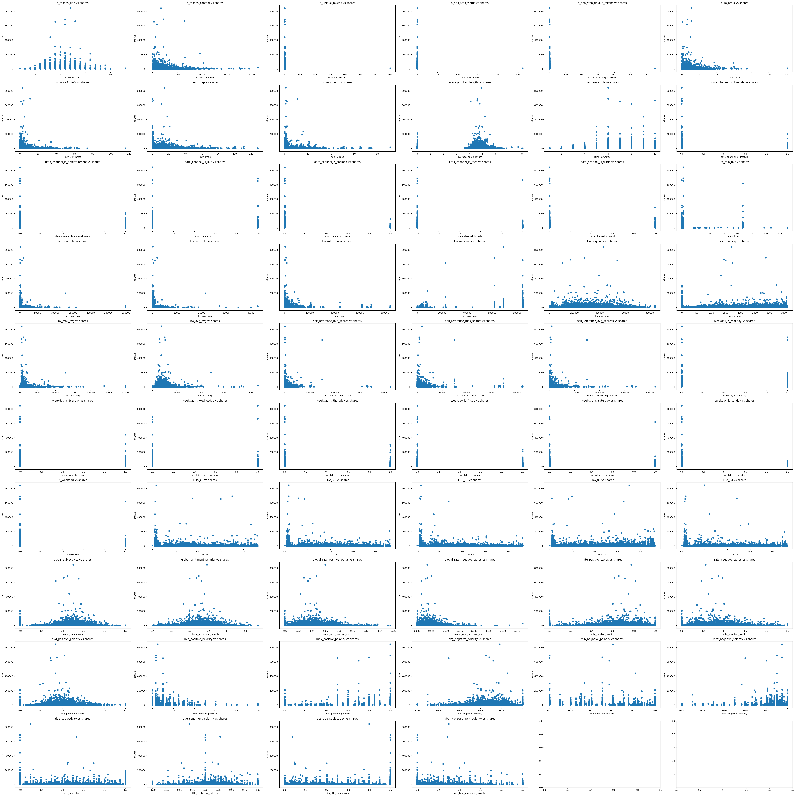

# Online News Popularity Predictor
## Dataset
* __Filename:__ [OnlineNewsPopularity.csv](OnlineNewsPopularity.csv)
* __Source:__ [Kaggle](https://www.kaggle.com/datasets/thehapyone/uci-online-news-popularity-data-set)
* __Dataset Detail:__ [Link](OnlineNewsPopularity.names)


## How to use this project
1. __Clone the repo:__ `git clone https://github.com/WeichenZhang89/ecs-171-ecs`
2. __Install libraries:__ `pip install pandas tensorflow matplotlib seaborn scikit-learn (on Terminal)`
3. __Install libraries:__ `!pip install pandas tensorflow matplotlib seaborn scikit-learn (on colab)`
4. __Run model:__ `python ML_model.ipynb`

   You might encounter "ImportError : No Moduled Name "tensorflow" when running "import tensorflow as tf". 

   To solve this, you can uninstall tensorflow and then reinstall it by pip uninstall tensorflow + pip install tensorflow in terminal.

   If you encounter "ERROR: Could not install packages due to an OSError: [Errno 2] No such file or directory" 

   and "HINT: This error might have occurred since this system does not have Windows Long Path support enabled"

   the most easy way to solve this is going into the registry editor with this directory "Computer\HKEY_LOCAL_MACHINE\SYSTEM\CurrentControlSet\Control\FileSystem", 

   and then edit "LongPathsEnabled" to a value of 1. Then it should be done.


## Introduction
The number of shares an online news article gets is of great interest to news sites and advertisers alike since it serves as a good estimator of how many people an article will reach. Our data set includes various attributes that can potentially influence the number of shares, such as the number of links, pictures, and videos the article has; which day of the week the article was released, what category the article belongs to (business, entertainment, tech, etc), the number of positive or negative words, among many others. Applying the right machine learning model, we will be able to predict how popular an article will be. With accurate predictions, authors and news outlets will be able to make relevant changes to increase engagement from readers before release. 

### Previous work

Most of the work on Kaggle employed a regression algorithm to fit the number of shares (target) using the various features of the data set. We saw few that used an SVM to predict the target, and one that used the a Random Forest. To differentiate ourselves from the work that has already been done, we combined the many methods we learned this quarter (linear regression, neural nets, SVM, Random Forest) to create a new ensemble model. 

## Methods
### Data Exploration
[Link to data exploration notebook](https://github.com/WeichenZhang89/ecs-171-ecs/blob/main/Data%20Exploration.ipynb)

#### 1. Reading the CSV file
- The data was loaded from the OnlineNewsPopularity.csv file into a Pandas DataFrame
```
data = pd.read_csv('OnlineNewsPopularity.csv')
data.columns = [col.strip() for col in data.columns]
```

#### 2. Observations and Features
- Determined the total number of observations (rows) and features (columns).
```
# Total rows
print(f"Total number of observations: {data.shape[0]}\n")
# Total columns
print(f"Total number of columns: {data.shape[1]}\n")
```

#### 3.Descriptive Statistics
- Displayed the descriptive statistics for each column.
```
pd.set_option('display.max_columns', None)
data.describe()
```

#### 4.Checking Missing Values
- Checked the dataset for missing values
```
null_data_count = data.isnull().sum().sum()
print (f"There are total of {null_data_count} missing data")
```

#### 5. Scatter Plots for Features vs. Shares
- Created scatter plots for each feature against the 'shares' column.
```
fig = plt.figure(figsize=(50, 50))

# Remove all data can not be plotted
plot_columns = []
for column in columns:
    if column not in ['url', 'timedelta', 'shares']:
        plot_columns.append(column)

plt_cols = 6
plt_rows = len(plot_columns) // plt_cols + 1

fig, axes = plt.subplots(nrows=plt_rows, ncols=plt_cols, figsize=(50, 5*plt_rows))

for i, col in enumerate(plot_columns):
    ax = axes[i // plt_cols, i % plt_cols]
    ax.scatter(data[col], data['shares'])
    ax.set_xlabel(col)
    ax.set_ylabel('shares')
    ax.set_title(f'{col} vs shares')

plt.tight_layout()
plt.show()
```

#### 6. Distribution of Continuous Features
- Visualized the distribution of continuous features using histograms.
```
# List of categorical columns provided by the dataset
categorical_cols = [
    'data_channel_is_lifestyle', 'data_channel_is_entertainment',
    'data_channel_is_bus', 'data_channel_is_socmed', 'data_channel_is_tech',
    'data_channel_is_world', 'weekday_is_monday', 'weekday_is_tuesday',
    'weekday_is_wednesday', 'weekday_is_thursday', 'weekday_is_friday',
    'weekday_is_saturday', 'weekday_is_sunday', 'is_weekend', 'url',
    'timedelta'
]
extra_drop = [
    "n_unique_tokens", "n_non_stop_words","n_non_stop_unique_tokens"
]
# Remove discrete columns from being plotted
continuous_data = data.drop(columns=categorical_cols+extra_drop)

fig, axes = plt.subplots(nrows=len(continuous_data.columns) // 2 + len(continuous_data.columns) % 2, ncols=2, figsize=(15, 80))

for ax, column in zip(axes.flatten(), continuous_data.columns):
    continuous_data[column].hist(ax=ax, bins=50, grid=False)
    ax.set_title(column)
    ax.set_xlabel('Values')
    ax.set_ylabel('Frequency')
    ax.set_yscale('log')
# Hide any unused subplots
for i in range(len(continuous_data.columns), len(axes.flatten())):
    axes.flatten()[i].axis('off')

plt.tight_layout()
plt.show()
```

#### 7. Distribution of One-Hot Encoded Categorical Features
- Plotted histograms for one-hot encoded categorical features.
```
#Related one-hot encoded columns histograms

data_channel_cols = [col for col in data.columns if col.strip().startswith('data_channel_is_')]
weekday_cols = [col for col in data.columns if col.strip().startswith('weekday_is_')]

fig, axes = plt.subplots(nrows=2, ncols=1, figsize=(15, 12))

# Plotting for data_channel columns
data[data_channel_cols].sum().plot(kind='bar', ax=axes[0], color='blue')
axes[0].set_title('Data Channel Distribution')
axes[0].set_xlabel('Data Channels')
axes[0].set_ylabel('Frequency')
axes[0].tick_params(axis='x', rotation=45)  # Tilting x axis labels
axes[0].set_yscale('log')

# Plotting for weekday columns
data[weekday_cols].sum().plot(kind='bar', ax=axes[1], color='green')
axes[1].set_title('Weekday Distribution')
axes[1].set_xlabel('Weekdays')
axes[1].set_ylabel('Frequency')
axes[1].tick_params(axis='x', rotation=45)  # Tilting x axis labels
axes[1].set_yscale('log')

plt.tight_layout()
plt.show()
```


### Data Preprocessing
[Link to preprocessing & first model notebook](https://github.com/WeichenZhang89/ecs-171-ecs/blob/main/Data%20Preprocessing%20%26%20ML%20model.ipynb)


#### Checking for null values
We run
```
null_data_count = data.isnull().sum().sum()
print (f"There are total of {null_data_count} missing data")
```
To check if there are any null values in our data and see that there are none.

#### Removing outliers
We use an isolation forest model to remove outliers with the following code:
```
IF_model = IsolationForest(contamination=0.1) # Remove 10% data
outliers = IF_model.fit_predict(data.drop(columns=['url', 'timedelta', 'shares'])) # Delete columns than don't need in IF and train IF model
data['outliers'] = outliers

# Remove outliers
data_outliers = data[data['outliers'] == -1]
new_data = data[data['outliers'] != -1].drop(columns = ['outliers'])
```

#### Data Normalization
We normalize our data using MinMaxScaler:
```
from sklearn.preprocessing import MinMaxScaler
import matplotlib.pyplot as plt

scaler = MinMaxScaler()
scaled_X = scaler.fit_transform(x)
```

#### Data Encoding
We change our number of shares (continuous value) to categorical variables. The following function is defined for transforming our continuous values.
```
def article_classifier(shares, top_percent):
    if shares >= top_percent[0.9]:
        return 'Great'
    elif shares >= top_percent[0.7]:
        return 'Good'
    elif shares >= top_percent[0.3]:
        return 'Normal'
    else:
        return 'Bad'
```

We then apply this function to our data with:
```
top_percent = new_data['shares'].quantile([0.3, 0.7, 0.9])

quality = []
for index, row in new_data.iterrows():
    quality.append(article_classifier(row['shares'], top_percent))

new_data['quality'] = quality
```

### Original model
TODO: Like the preprocessing section, simply elaborate what was done (what code was run, etc). In developing our first model. No explanations, just what we did


### Improved model
TODO: Same thing, but explain it for our second model

## Results
TODO: Summarize what happened to our data after we normalized it (put the result of .describe() here).

TODO: Accuracy & Overfitting graph for model 1.

TODO: Accuracy & Overfitting graph for model 2.

Note: Just reporting the results will be good enough. I think the analysis is supposed to be done in the Discussion section.


## Discussion
TODO: Repeat the Methods & Results section, but explain the reasoning behind each section. 

TODO: Explore results of our first model, do overfitting analysis

TODO: Explain how second model differs.

TODO: Explore second model results, do overfitting analysis.

TODO: Summarize final results of model 2 (accuracy, etc).


Note: The following was preserved from our original milestone submissions. I think we only have to tweak & add on what we have for the discussion section.

### Data Exploration
#### Descriptive Statistics
- The descriptive statistics provided a summary of the central tendency, dispersion, and shape of the distribution of the dataset. It's a very useful method for a quick statistical summary, however it doesn't provide a full picture of data distribution. For a more comprehensive understanding, please refer to the histograms below.

#### Scatter Plots for Features vs. Shares
- Scatter plots provided visual representation of the relationship between each feature and the target variable ('shares'). This helped in identifying patterns, outliers, or any potential relationships between the variables.



### Data Preprocessing
#### Data Imputation
From the result of 

```
null_data_count = data.isnull().sum().sum()
print (f"There are total of {null_data_count} missing data")
```

We found that our data did not have any null values. Although we did not have any null values, we saw from our scatterplots that many features had outliers that could be problematic. To address these outliers, we used an isolation forest model to remove the outliers. More information on the isolation forest model can be found [here](https://scikit-learn.org/stable/modules/generated/sklearn.ensemble.IsolationForest.html#sklearn.ensemble.IsolationForest).

#### Dropping features
The ‘url’ column contains the url for each article in our observations. The ‘timedelta’ column indicates days between the article publication and the dataset acquisition. Since these two features will have no effect on how many shares an article will get, we excluded these variables when training our model.

#### Data normalization
During the data exploration phase, we saw from our scatterplots that only a few of our features (global_subjectivity and avg_positive_polarity) for example, seemed to be normally distributed. Since only a few of our features were normally distributed, we rescaled our data using MinMaxScaler() so that our feature values were between 0 and 1.

#### Data encoding
Rather than having our model be a regression model that predicts a continuous value, we decided to make it a classifier instead. This made more sense to us because predicting the exact number of shares an article will get is not as important or as useful as knowing how “interesting” an article would be. For instance, it is not important that an article will be predicted to get exactly 200 shares but rather that it would belong to a class of being an interesting article. 

In order to accomplish this, we split the number of shares (a continuous value) into different classes as such:

* Great Article: Shares >= 90%
* Good Article: 70% <= Shares < 90%
* Normal Article: 30% <= Shares < 70%
* Bad article: Shares < 30%

Where positive words such as “Great” and “Good” denote that it will get many shares and negative words denote that it will get few. For example, a share number that is above the 90th percentile out of our data would be classified as a "Great Article". We used one-hot encoding mentioned in the methods sections to encode the continuous values into binary values.

### Developing our original model
Since simple regression models have already been done by other people on this data set, we set out to develop an ensemble model that takes different predictions from multiple machine learning models before making its decision. 

The models we used for building the ensemble model were:

* A simple linear regression model
* A neural network model
* A model utilizing Random Forest
* A SVM model

Our model then takes account of the predictions made by different models, and takes the mode (or mean) as the prediction value.

The model complexity of our ensemble model can be defined by the complexity of the models the ensemble is made of. For instance, an ensemble model that considers predictions from only linear regression models would be considered simple, while an ensemble consisting of neural network models and a random forest model more complex.

Note: During testing, we found that the SVM model did not perform well (around 40% accuracy). We excluded the SVM model from our list of models because it was inaccurate and also took a very long time to train.

#### Test for overfitting (original model)
We tested three ensemble models. Ordered in increasing complexity, they were:

   * Model 1: Ensemble of 3 linear regression models (With ridge cost function)
   * Model 2: Ensemble of 1 linear regression model + 2 neural network models
   * model 3: Ensemble of 2 neural network models + 1 Random Forest model

The train/test accuracy for our models were as follows:

Model 1:
   * Training Accuracy: 0.4529
   * Testing Accuracy: 0.4414

Model 2:
   * Training Accuracy: 0.4740
   * Testing Accuracy: 0.4505

Model 3:
   * Training Accuracy: 0.8530
   * Testing Accuracy: 0.4561

While accuracy improves slightly as model complexity increases, we see that the difference between train/test accuracy increases greatly when going from Model 2 to Model 3. Based on these observations, we can conclude that Model 3 is overfitting and that the ideal complexity for our model would be somewhere inbetween Model 2 and Model 3.

### Developing our improved model
TODO: Write the reasoning behind the improved model

## Conclusion
TODO: What do we think of our model? What can we do better?

TODO: Could be good to include Kenny's vision for using the model along with an article scraper for future work.

## Contributions
<!-- Things need to be added here -->

## Link to Jupyter Notebook
[Jupyter Notebook](https://github.com/WeichenZhang89/ecs-171-ecs/blob/main/Data%20Preprocessing%20%26%20ML%20model.ipynb)
